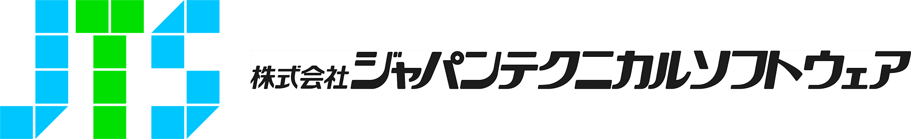

# Sekiban

Sekiban - Event Sourcing Framework using .NET. Can store data into Cosmos DB and Dynamo DB

  

## What is Sekiban?

**Sekiban** is an application development framework that leverages **Event Sourcing and CQRS** principles. Built with C#
and .NET Core 7+, it allows developers to use a declarative API to create event sourcing applications. Sekiban supports
various event stores such as [Microsoft Azure Cosmos DB](https://azure.microsoft.com/en-us/products/cosmos-db)
and [Amazon Dynamo DB](https://aws.amazon.com/dynamodb/), facilitating deployment on either Azure or AWS.

## Getting started
Do you want to start coding? If so, please see [Quick Start](https://github.com/J-Tech-Japan/Sekiban/blob/main/docs/docfx_project/articles/quick-start.md)

## Sponsors

Sekiban is an Apache 2.0 open source project with its ongoing development. We will launch soon for the sponsorship information. If you are interested in the special sponsorship, please [contact us](https://github.com/J-Tech-Japan/Sekiban#support-and-training).

  <h3 align="center">Special Sponsor</h3>

  

## Understanding Event Sourcing and CQRS

If you've landed here, you're likely already familiar with Event Sourcing and CQRS. However, if you require more
detailed insights, Greg Young's informative YouTube talk might be of assistance. Check out
the [transcript](https://www.eventstore.com/blog/transcript-of-greg-youngs-talk-at-code-on-the-beach-2014-cqrs-and-event-sourcing)
of Greg's presentation at the Code on the Beach 2014 event on CQRS and Event Sourcing.
Greg suggests creating your event sourcing system instead of relying on frameworks, a viewpoint I share, as constructing
your framework can deepen your understanding of event sourcing concepts.

However, we recognize many developers prefer concentrating on business logic and swiftly proceeding with tools and
document databases. Given the recent advances in database speed and scalability across the cloud, event sourcing can be
quite efficient with the use of frameworks and cloud solutions.
Fortunately, as Sekiban is open-source, developers wishing to delve deeper can experiment with the source code housed in
the repository.

***Disclaimer:*** Despite using a framework, it's essential for developers to be familiar with event sourcing concepts,
especially when optimizing Query performance for a growing user base and data set post-launch. Adequate knowledge of
Event Sourcing and CQRS is mandatory when converting it to a microservice or improving performances.

## Key Features of Sekiban

Enhance your application development experience with Sekiban suited for those who prioritize efficiency and
effectiveness:

- **Simple Commands and Events:** Facilitates straightforward creation of functionality within your application.
- **Publish-only Commands and Events:** Provides way to save events without projecting aggregates.
- **Optimistic Aggregate Version Check:** Enables efficient conflict detection in concurrent environments.
- **Event Versions:** Allows for improved forward compatibility.
- **Single/Multi Aggregate Projections:** Supports projections at both individual and multiple aggregate levels.
- **Projections Snapshots:** Offers the ability to capture the state of a projection at a certain point in time.
- **Large Snapshots Storage:** Accommodate sizable snapshots using Azure Blob Storage or Amazon S3.
- **Built-in Testing Framework:** Simplifies testing with an integrated suite.
- **Cosmos DB / Dynamo DB Datastore:** Provides scalable and globally distributed data storage solutions.
- **Tenant Partitions:** Facilitates separation of data based on tenant for easier data management and handling.
- **Query from Multiple Projections:** Enables querying from a range of projections for more dynamic data analysis.
- **Command and Query Web API Generator with Swagger Support:** Streamlines API design, building, and documentation.

These, coupled with many more features, allow developers to focus on business aspects, implementing commands, events,
projections, tests, and queries for practical solutions without unnecessary complexity.

## Compatibility

Sekiban is compatible with .NET 7 and 8.

For **Cosmos DB**, Sekiban supports
the [Hierarchical Partition Key](https://learn.microsoft.com/en-us/azure/cosmos-db/hierarchical-partition-keys?tabs=net-v3%2Cbicep)
feature. This enables more efficient querying using Cosmos DB by creating a Tenant (or Root Partition Key), Aggregate
Type, and Partition Key.

When using **Dynamo DB** with Sekiban, you need to set up a Partition Key and Sort Key.

## Scale of Sekiban Projects

As of Sekiban version 0.14, the framework doesn't have built-in materialized view helper features. Sekiban's Live
Projection capability is well-suited for small to medium-sized systems. Typically, Sekiban can handle Live Projections
provided the system memory can accommodate the size of the Multiple Projections.

For more insights on Live Projections, please reference this informative article by Anton
Stöckl: [Live Projections for Read Models with Event Sourcing and CQRS](https://medium.com/@TonyBologni/live-projections-for-read-models-with-event-sourcing-and-cqrs-42dd18b19fd0).

Developers can implement materialized views using Cosmos DB's and Dynamo DB's change feed feature. Although creation of
materialized views with Change Feed is a straightforward process, it does not directly pertain to the Sekiban
Framework's core functions, hence it hasn't been included within the framework.

## Open Source

Sekiban is released as open source under the Apache 2.0 license. You can view
our [License](https://github.com/J-Tech-Japan/Sekiban/blob/main/LICENSE) here. We welcome developers to fork the
project, fix bugs, or add new features as they wish. For those interested in contributing, we offer a
detailed [Contribution Guideline](https://github.com/J-Tech-Japan/Sekiban/blob/main/CONTRIBUTING.md)
and [Code of Conduct](https://github.com/J-Tech-Japan/Sekiban/blob/main/CODE_OF_CONDUCT.md). J-Tech Japan owns this
project and determines its future direction.

## Documentation

We are planning to deploy documentation, eventually please see

https://github.com/J-Tech-Japan/Sekiban/blob/main/docs/docfx_project/articles/intro.md

## Support and Training

J-Tech Japan welcomes sponsors for this project to help maintain a high-quality framework. If you require training or
seminars, please contact us at [sekibanadmin@jtechs.com](mailto:sekibanadmin@jtechs.com).

[Contribution Guideline](https://github.com/J-Tech-Japan/Sekiban/blob/main/CONTRIBUTING.md)

[Code of Conduct](https://github.com/J-Tech-Japan/Sekiban/blob/main/CODE_OF_CONDUCT.md)

## About Us
**J-Tech Japan (株式会社ジェイテックジャパン)** has been developing sekiban since 2022. We are located in Tokyo, Japan and we have been developing enterprize web application since 2008.

  

# License

Apache 2.0
[See License](https://github.com/J-Tech-Japan/Sekiban/blob/main/LICENSE)

Copyright (c) 2022- J-Tech Japan