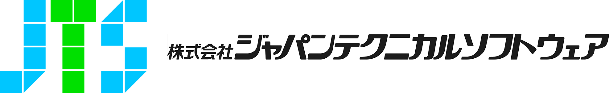

# Sekiban - Event Sourcing and CQRS Framework

<!-- SEKIBAN_PURE_POLICY_START -->
> **Sekiban.Pure support policy / サポート方針**
>
> Sekiban.Pure is in maintenance mode (no new features; .NET 9). We plan to complete its lifecycle with .NET 9 (EOL Nov 10, 2026) — but if you run it in production, we will bring it to .NET 10/11 as a pure compatibility migration, no features (we shipped exactly this for Sekiban(Core) 0.25.0: unchanged public API, bidirectional data compatibility). Tell us in [#1169](https://github.com/J-Tech-Japan/Sekiban/issues/1169). For new projects we recommend Sekiban DCB.
>
> Sekiban.Pure は現在メンテナンスモードです（機能追加なし・.NET 9 対応）。.NET 9 の EOL（2026-11-10）でライフサイクルを完了する予定ですが、本番利用中の方がいれば .NET 10/11 への対応を機能追加なしの互換移行として行います（Sekiban(Core) 0.25.0 で同方式を実施済み: 公開 API 無変更・保存データ双方向互換）。必要な方は [#1169](https://github.com/J-Tech-Japan/Sekiban/issues/1169) でお知らせください。新規プロジェクトには Sekiban DCB を推奨します。
<!-- SEKIBAN_PURE_POLICY_END -->


<p align="center">
  
</p>

**Sekiban** is an event sourcing and CQRS framework for .NET. It supports Azure Cosmos DB, PostgreSQL, and DynamoDB as event stores, with Microsoft Orleans for actor-based scalability.

📚 **Documentation**: [sekiban.dev](https://www.sekiban.dev/)

## Implementations

> **Note**: Sekiban has two implementations. **DCB (Dynamic Consistency Boundary)** is the recommended approach for new projects. Sekiban.Pure and Sekiban.Core are in maintenance mode.

| Implementation | Description | Status |
|---------------|-------------|--------|
| **Sekiban DCB** | Dynamic Consistency Boundary - tag-based event sourcing | ✅ Recommended |
| Sekiban.Pure | Traditional aggregate-based event sourcing | 🛠️ Maintenance |
| Sekiban.Core | Single-server version without actor model | 🛠️ Maintenance |
| Sekiban.ts | TypeScript event sourcing | 🔬 Alpha |

## Quick Start

### Sekiban DCB (Recommended)

```bash
dotnet new install Sekiban.Dcb.Templates
dotnet new sekiban-dcb-orleans -n YourProjectName
```

### Cloud Deployment

DCB supports both Azure and AWS:

| Component | Azure | AWS |
|-----------|-------|-----|
| Event Store | Cosmos DB / PostgreSQL | DynamoDB |
| Snapshots | Azure Blob Storage | Amazon S3 |
| Orleans Clustering | Azure Table / Cosmos DB | RDS PostgreSQL |
| Orleans Streams | Azure Queue | Amazon SQS |

## What is DCB?

**Dynamic Consistency Boundary (DCB)** replaces rigid per-aggregate transactional boundaries with a context-sensitive consistency boundary based on event tags. Instead of maintaining multiple streams and coordinating cross-aggregate invariants via sagas, DCB uses a single event stream per bounded context where each event carries tags representing affected entities.

Key benefits:
- **Flexible boundaries**: Define consistency scope per command, not per aggregate
- **No saga complexity**: Cross-entity invariants without compensating events
- **Optimistic concurrency**: Tag-based conflict detection
- **Scalable**: Actor model integration with Microsoft Orleans

Learn more at [dcb.events](https://dcb.events)

## Documentation

- **Website**: [sekiban.dev](https://www.sekiban.dev/)
- **DCB Documentation**: [docs/dcb_llm](./docs/dcb_llm/) (English) | [docs/dcb_llm_ja](./docs/dcb_llm_ja/) (日本語)
- **Pure Documentation**: [docs/llm](./docs/llm/) (English) | [docs/llm_ja](./docs/llm_ja/) (日本語)
- **Storage consistency contract (DCB)** — what each event store guarantees, and what it does not: [English](./docs/dcb_llm/11_storage_providers.md#consistency-contract) | [日本語](./docs/dcb_llm_ja/11_storage_providers.md#整合性契約). Read this before choosing Cosmos DB for a workload that needs atomic event/tag visibility.

## MCP (Model Context Protocol)

Sekiban provides MCP support for AI coding assistants:

```bash
claude mcp add sekibanDocument --transport sse https://sekiban-doc-mcp.azurewebsites.net/sse
```

## NuGet Packages

### DCB Packages (Recommended)

| Package | Description |
|---------|-------------|
| [Sekiban.Dcb.Core](https://www.nuget.org/packages/Sekiban.Dcb.Core) | Core DCB framework |
| [Sekiban.Dcb.Orleans.WithResult](https://www.nuget.org/packages/Sekiban.Dcb.Orleans.WithResult) | Orleans integration |
| [Sekiban.Dcb.Postgres](https://www.nuget.org/packages/Sekiban.Dcb.Postgres) | PostgreSQL event store |
| [Sekiban.Dcb.CosmosDb](https://www.nuget.org/packages/Sekiban.Dcb.CosmosDb) | Cosmos DB event store |
| [Sekiban.Dcb.DynamoDB](https://www.nuget.org/packages/Sekiban.Dcb.DynamoDB) | DynamoDB event store |
| [Sekiban.Dcb.BlobStorage.AzureStorage](https://www.nuget.org/packages/Sekiban.Dcb.BlobStorage.AzureStorage) | Azure Blob snapshots |
| [Sekiban.Dcb.BlobStorage.S3](https://www.nuget.org/packages/Sekiban.Dcb.BlobStorage.S3) | S3 snapshots |

### Legacy Packages

Legacy Sekiban.Core and Sekiban.Pure packages are available on NuGet but are no longer recommended for new projects. See [core_main branch](https://github.com/J-Tech-Japan/Sekiban/tree/core_main) for legacy documentation.

## Sponsors

Sekiban is Apache 2.0 open source. Support us via [GitHub Sponsors](https://github.com/sponsors/J-Tech-Japan).

<p align="center">
  <h3 align="center">Special Sponsor</h3>
</p>

<p align="center">
  <a target="_blank" href="https://www.jtsnet.co.jp">
  
  </a>
</p>

## About

**J-Tech Japan (株式会社ジェイテックジャパン)** has been developing Sekiban since 2022.

<p align="center">
  <a target="_blank" href="https://www.jtechs.com/japan/">
  
  </a>
</p>

## Community

Join the **J-Tech JAPAN OSS Discord** to ask questions, share ideas, and connect with other Sekiban users. There is a dedicated channel for the Sekiban community.

👉 [Join our Discord](https://discord.gg/kMdv978X)

## Support

For training or support, contact [sekibanadmin@jtechs.com](mailto:sekibanadmin@jtechs.com).

- [Contribution Guidelines](./CONTRIBUTING.md)
- [Code of Conduct](./CODE_OF_CONDUCT.md)

## Contributors

<a href="https://github.com/J-Tech-Japan/Sekiban/graphs/contributors">
  
</a>

## License

Apache 2.0 - [See License](./LICENSE)

Copyright (c) 2022- J-Tech Japan
