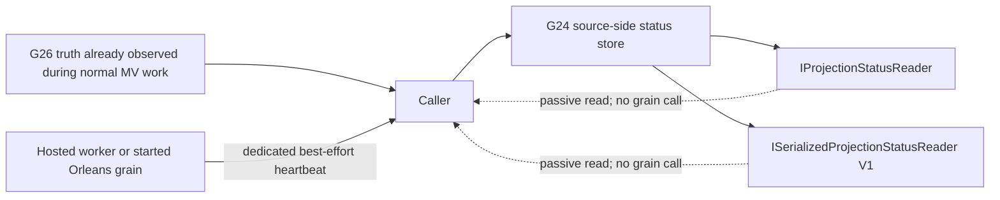

# Materialized View Basics

> **Navigation**
> - [Core Concepts](01_core_concepts.md)
> - [Getting Started](02_getting_started.md)
> - [Commands, Events, Tags, Projectors](03_aggregate_command_events.md)
> - [MultiProjection](04_multiple_aggregate_projector.md)
> - [Query](05_query.md)
> - [Command Workflow](06_workflow.md)
> - [Serialization & Domain Types](07_json_orleans_serialization.md)
> - [API Implementation](08_api_implementation.md)
> - [Client UI (Blazor)](09_client_api_blazor.md)
> - [Orleans Setup](10_orleans_setup.md)
> - [Storage Providers](11_storage_providers.md)
> - [Testing](12_unit_testing.md)
> - [Common Issues and Solutions](13_common_issues.md)
> - [ResultBox](14_result_box.md)
> - [Value Objects](15_value_object.md)
> - [Deployment Guide](16_deployment.md)
> - [Cold Events and Catch-up](19_cold_events.md)
> - [Materialized View Basics](20_materialized_view.md) (You are here)
> - [Unsafe Window Materialized View](21_unsafe_window_materialized_view.md)

Materialized views are database-backed read models for DCB. Instead of keeping the read model only in Orleans memory,
Sekiban can apply the ordered event stream into SQL tables and let the application query those tables directly.

## What Problem Does It Solve?

MultiProjection is still the default read-model path in DCB. Materialized views are useful when you need:

- SQL paging, filtering, and sorting over large lists
- direct table access from dashboards, BI tools, or external services
- a relational representation that can be indexed independently from the event store
- a read model that survives Orleans grain deactivation without snapshot-specific query code

Use MultiProjection when reads are fully inside Sekiban. Use materialized views when the read side must be exposed as a
database.

## Runtime Shape

The current runtime is split into provider-neutral core plus provider packages:

- `Sekiban.Dcb.MaterializedView`
  Core contracts such as `IMaterializedViewProjector`, `IMvInitContext`, `IMvApplyContext`, `MvRegistryEntry`, and the
  catch-up worker.
- `Sekiban.Dcb.MaterializedView.Postgres`
  PostgreSQL implementation for table registration, row access, registry persistence, and event application.
- `Sekiban.Dcb.MaterializedView.SqlServer`
  SQL Server implementation for registry persistence and ordered event application.
- `Sekiban.Dcb.MaterializedView.MySql`
  MySQL implementation for registry persistence and ordered event application.
- `Sekiban.Dcb.MaterializedView.Sqlite`
  SQLite implementation for registry persistence and ordered event application.
- `Sekiban.Dcb.MaterializedView.Orleans`
  Orleans grain orchestration, startup activation, and `IMvOrleansQueryAccessor`.

The event source of truth is still the DCB event store. Materialized views are downstream projections from that store.

The event source and the materialized-view target are separate dependencies. The source provider may be PostgreSQL,
Cosmos DB, DynamoDB, SQLite, or another `IEventStore` implementation, while the target executor writes to the
database registered by the materialized-view provider.

## High-Level Flow

1. A DCB command writes an event to the global event store.
2. The materialized view runtime reads ordered events from the store.
3. A projector translates each event into SQL statements.
4. The registry records the current catch-up position and active version.
5. Orleans coordinates stream delivery, buffering, and refresh.
6. The application queries the resulting database table.

This means correctness still depends on ordered event application, not on ad-hoc SQL updates.

## Passive Projection Status

Classic materialized views publish their progress through the existing G24 `IProjectionStatusReader` and
`ISerializedProjectionStatusReader` surfaces. No materialized-view-specific reader or target-database status table is
created. The publisher writes to the status store supplied by the event-source provider (PostgreSQL, Cosmos DB,
DynamoDB, or SQLite).



Use `MvProjectionStatusIdentity.Create(viewName, viewVersion)` to obtain the exact `ProjectorName` and
`ProjectorVersion` filters. The identity is stable and collision-free for punctuation and Unicode names. The worker or
grain always publishes under its already validated, exact service id.

The mapping is fail-closed:

| G26 truth/lifecycle | G24 phase | `IsCaughtUp` eligibility |
| --- | --- | --- |
| `Unknown` | `unknown` | never |
| Known + `Initializing` | `starting` | never |
| Known + `CatchingUp` | `catchingUp` | never |
| Known-zero/nonzero + `Ready` | `caughtUp` | only when the normal G24 freshness, remaining-count, fault, and conflict checks also pass |
| Known-zero/nonzero + `Active` | `active` | only when the same G24 checks pass |
| Known + `Retired` | `stopped` | never |
| `Faulted` | `faulted` | never |

Known-zero carries `SortableUniqueId.MinValue`; it is not represented as `Unknown`. Publication is not performed by
event-apply, stream, query, or reader hot paths. Hosted workers publish after a catch-up cycle, and Orleans starts a
separate publisher timer only after `EnsureStartedAsync`. Status reads therefore do not activate an MV grain. Writes
are best-effort, independently timed out, and use generic secret-free failure diagnostics; publication failure does not
stop event application or queries. The heartbeat consumes only the runtime's cached authoritative snapshot: neither
the heartbeat nor either G24 reader resolves, opens, or queries the materialized-view target database.

## Registering the Runtime

Typical registration in an Orleans host looks like this:

```csharp
builder.Services.AddSekibanDcbMaterializedView(options =>
{
    options.BatchSize = 100;
    options.PollInterval = TimeSpan.FromSeconds(1);
});

builder.Services.AddMaterializedView<WeatherForecastMvV1>();

builder.Services.AddSekibanDcbMaterializedViewPostgres(
    builder.Configuration,
    connectionStringName: "DcbMaterializedViewPostgres",
    registerHostedWorker: false);

builder.Services.AddSekibanDcbMaterializedViewOrleans();
```

Source: `internalUsages/DcbOrleans.WithoutResult.ApiService/Program.cs`

Notes:

- `AddSekibanDcbMaterializedView` registers shared options.
- `AddMaterializedView<TView>` registers one projector.
- `AddSekibanDcbMaterializedViewPostgres` wires the registry and executor.
- `AddSekibanDcbMaterializedViewSqlServer`, `AddSekibanDcbMaterializedViewMySql`, and `AddSekibanDcbMaterializedViewSqlite`
  provide the same classic MV runtime for their respective databases.
- `AddSekibanDcbMaterializedViewOrleans` adds Orleans-side activation and query access.

Provider-specific registration examples:

```csharp
builder.Services.AddSekibanDcbMaterializedViewSqlServer(configuration, "DcbMaterializedViewSqlServer");
builder.Services.AddSekibanDcbMaterializedViewMySql(configuration, "DcbMaterializedViewMySql");
builder.Services.AddSekibanDcbMaterializedViewSqlite(configuration, "DcbMaterializedViewSqlite");
```

### Service-scoped event sources

Every materialized-view catch-up worker must be bound to one exact, non-empty service id. In a process that hosts more
than one service, disable the provider's automatic worker and register one immutable worker per service:

```csharp
builder.Services.AddSekibanDcbMaterializedView();
builder.Services.AddMaterializedView<WeatherForecastMvV1>();

// Event source and MV target can use different backends/connections.
builder.Services.AddSekibanDcbPostgres(sourceConnectionString);
builder.Services.AddSekibanDcbMaterializedViewPostgres(
    targetConnectionString,
    registerHostedWorker: false);

builder.Services.AddSekibanDcbMaterializedViewWorkerForService("orders");
builder.Services.AddSekibanDcbMaterializedViewWorkerForService("billing");
```

The standard PostgreSQL, Cosmos DB, DynamoDB, and SQLite event-store registrations provide `IEventStoreFactory`. Each
of the four classic target executors resolves `CreateForService(serviceId)` before reading events, so two services
sharing one source backend cannot consume one another's events. A custom event source can use the compatible executor
constructor that accepts `IEventStore`; it must still provide an explicit service identity.

Orleans grain keys carry the same identity. Build a key with
`MvGrainKey.Build("orders", "WeatherForecast", 1)`; the grain validates and forwards that exact service id to the
executor before stream setup or store access.

For a deliberately single-service legacy deployment only, opt into the literal default explicitly:

```csharp
builder.Services.AddSekibanDcbMaterializedView(options =>
{
    options.ServiceId = DefaultServiceIdProvider.DefaultServiceId;
    options.AllowDefaultServiceId = true;
});
```

Do not rely on an implicit `default` identity for an ordinary multi-service registration. Missing, blank, default, or
mismatched identities are rejected before materialized-view infrastructure or event-store I/O.

Projectors still emit SQL directly. For portable projectors, branch on `ctx.DatabaseType` and emit the SQL dialect that
matches the selected provider. Unsafe Window MV remains PostgreSQL-only in v1.

## Writing a Projector

A materialized view projector implements `IMaterializedViewProjector`.

```csharp
public sealed class WeatherForecastMvV1 : IMaterializedViewProjector
{
    public string ViewName => "WeatherForecast";
    public int ViewVersion => 1;

    public MvTable Forecasts { get; private set; } = default!;

    public async Task InitializeAsync(IMvInitContext ctx, CancellationToken cancellationToken = default)
    {
        Forecasts = ctx.RegisterTable("forecasts");
        await ctx.ExecuteAsync($"""
            CREATE TABLE IF NOT EXISTS {Forecasts.PhysicalName} (
                forecast_id UUID PRIMARY KEY,
                location TEXT NOT NULL,
                forecast_date DATE NOT NULL,
                temperature_c INT NOT NULL,
                summary TEXT NULL,
                is_deleted BOOLEAN NOT NULL DEFAULT FALSE,
                _last_sortable_unique_id TEXT NOT NULL,
                _last_applied_at TIMESTAMPTZ NOT NULL DEFAULT NOW()
            );
            """, cancellationToken: cancellationToken);
    }

    public Task<IReadOnlyList<MvSqlStatement>> ApplyToViewAsync(
        Event ev,
        IMvApplyContext ctx,
        CancellationToken cancellationToken = default) =>
        Task.FromResult<IReadOnlyList<MvSqlStatement>>([]);
}
```

Source: `internalUsages/Dcb.Domain.WithoutResult/MaterializedViews/WeatherForecastMvV1.cs`

Projector responsibilities:

- `InitializeAsync`
  Register logical tables and issue `CREATE TABLE` / `CREATE INDEX` statements.
- `ApplyToViewAsync`
  Translate one event into one or more SQL statements.

## Pre-Provisioned Schema and Host-Owned SQL Policy

Initialization keeps the historical `CreateOrEnsure` behavior by default. Hosts that provision database objects through
deployment migrations can select `VerifyOnly`:

```csharp
builder.Services.AddSekibanDcbMaterializedView(options =>
{
    options.InitializationMode = MvInitializationMode.VerifyOnly;
    options.SqlStatementPolicy = MyHostSqlPolicy.Instance;
});
```

Verify-only derives its bindings and required schema from the declarative contract before it enters the projector
initialization path. It calls the provider's dedicated `IMvReadOnlyMvInspector` for catalog and registry reads only;
`IMvApplyHost.InitializeAsync`, `EnsureInfrastructureAsync`, normal write connections, registration, transactions, and
commits are not fallback paths. A compatible deployment must therefore provision both framework registry tables and
the projector tables, including the registry binding rows. A missing or incompatible binding is a typed failure and is
never seeded automatically. The zero-DDL guarantee covers Sekiban-owned connections; arbitrary user/projector code is
outside that process boundary.

Verify-only remains isolated after the schema gate succeeds. Target-checkpoint capture, empty-history catch-up, status
refresh, activation, and event-apply paths cannot call a mutating registry API; registry writes are not a success-path
fallback. The executor and Orleans grain also avoid normal projector initialization, subscriptions, refresh timers, and
write-oriented registry connections in this mode. The dedicated inspector owns its read-only route: SQLite opens with
`Mode=ReadOnly`, PostgreSQL uses `default_transaction_read_only=on`, MySQL starts a read-only transaction session, and
SQL Server uses an explicit inspection principal. Registry entries, the active pointer, and catalog metadata are read
through that inspector only. SQL Server does not use `ApplicationIntent=ReadOnly` as an enforcement mechanism on a
standalone instance: configure `MvOptions.SqlServerInspectionConnectionString` with a distinct least-privilege
inspection principal (for example, a database user in `db_datareader` with no DML or DDL permissions plus the
non-writing catalog metadata visibility needed by the contract, such as database `VIEW DEFINITION`). Verify-only
fails with a typed `UnsupportedProviderCapability` failure before catalog inspection when that capability is absent or
cannot be established. The provider catalog allowlist is read-only; SQLite metadata uses table-valued PRAGMA catalog
functions rather than mutating PRAGMA statements, and derives declared lengths/precision/scale and generated
expressions where SQLite exposes them.

Projectors that support verify-only initialization describe their target schema with the additive, format-versioned
`MvSchemaContract`/`IMvSchemaRequirementsProvider` contract (format version `1`):

```csharp
public IReadOnlyList<MvSchemaTableRequirement> GetSchemaRequirements(
    MvDbType databaseType,
    IMvTableBindings tables) =>
[
    new(
        "forecasts",
        tables.GetPhysicalName("forecasts"),
        [
            new("forecast_id", MvSchemaTypeFamily.Guid, false),
            new("location", MvSchemaTypeFamily.String, false),
            new("forecast_date", MvSchemaTypeFamily.DateTime, false),
            new("temperature_c", MvSchemaTypeFamily.Integer, false),
            new("summary", MvSchemaTypeFamily.String, true)
        ],
        ["forecast_id"])
];
```

The verifier reports all mismatches in deterministic order. In addition to type, nullability, and primary-key shape, the
contract can describe normalized defaults, required indexes (ordered columns and uniqueness), generated-column
semantics and expression, character size, and numeric precision/scale. The provider-neutral checks are mapped to native
metadata by PostgreSQL, MySQL, SQL Server, and SQLite. A missing table/column, incompatible type/nullability/key or
metadata, missing schema contract, or
unsupported metadata capability throws the typed `MvInitializationException` with an
`MvInitializationFailureReason`. These failures happen before event reads, view writes, registry mutation, catch-up,
or activation. A host that has not opted into the schema contract therefore fails closed in verify-only mode.

The compatibility proof includes a binary consumer restored against the published `10.13.0` package and then run
without recompilation against the branch assembly; see
[`Sekiban.Dcb.MaterializedView.BinaryConsumer`](../../dcb/tests/Sekiban.Dcb.MaterializedView.BinaryConsumer/README.md).

Every projector-supplied initialization and apply statement is also presented to the host-owned
`IMvSqlStatementPolicy` before provider execution. `MvSqlStatementContext` contains the exact service id, view name and
version, `Initialization` or `Apply` phase, the exact `ProjectorInitialize`/`ProjectorApply`/`ProjectorQuery` origin,
provider `DatabaseType`, logical/physical table bindings, SQL text, and parameter metadata. A policy can return an
optional rule id with `MvSqlPolicyDecision.Allow(ruleId)` or `Reject(reason, ruleId)`:

```csharp
public sealed class MyHostSqlPolicy : IMvSqlStatementPolicy
{
    public static MyHostSqlPolicy Instance { get; } = new();

    public ValueTask<MvSqlPolicyDecision> EvaluateAsync(
        MvSqlStatementContext context,
        CancellationToken cancellationToken = default) =>
        ValueTask.FromResult(
            context.Phase == MvSqlStatementPhase.Initialization
                ? MvSqlPolicyDecision.Reject("Initialization SQL is migration-owned.")
                : MvSqlPolicyDecision.Allow());
}
```

Rejection is typed as `MvSqlPolicyRejectedException`; its safe failure contains the service/view/version, phase, exact
origin, provider, rule id, statement index/batch size, and SQL fingerprint, but does not copy SQL or parameter values
into the failure. Initialization rejection occurs before `EnsureInfrastructureAsync` or a provider command. Apply
rejection rolls back the event transaction before any projector statement or registry checkpoint is committed. In
`Legacy` mode, existing raw `Connection`/`Transaction` access remains source-compatible.
Hosts that need a hard SQL boundary opt into `Enforced` mode:

```csharp
options.SqlStatementPolicyMode = MvSqlStatementPolicyMode.Enforced;
```

Enforced mode wraps `QueryRowsAsync`, `QuerySingleOrDefaultAsync`, and `ExecuteScalarJsonAsync` before the provider
port, removes raw connection/transaction exposure, and preflights every statement in an initialization or apply batch
before the first statement executes. Missing policy, policy faults, invalid decisions, and denials fail closed with
typed reasons; cancellation remains `OperationCanceledException`. SQL is treated as opaque text by the runtime, so a
host allowlist must reject mutating CTEs, comments, or multi-statement text according to its own policy.

The hosted worker uses the same central initialization gate. In verify-only mode it publishes a faulted verification
status, waits for the configured retry interval, and remains stopped until a later verification succeeds; it never
falls back to ensure mode.

The package default remains `CreateOrEnsure` plus `Legacy` and `MvAllowAllSqlStatementPolicy`, preserving existing
callers that do not opt into the new boundary.

## Idempotency and Ordering

Materialized views must be safe to replay. The usual pattern is:

- keep `_last_sortable_unique_id` on every row
- update a row only when the incoming sortable id is newer
- treat the event store ordering as the source of truth

Example:

```sql
UPDATE some_table
SET value = @Value,
    _last_sortable_unique_id = @SortableUniqueId
WHERE id = @Id
  AND _last_sortable_unique_id < @SortableUniqueId;
```

This lets catch-up and live stream delivery converge on the same final state.

## Materialized View Registry

The runtime stores operational metadata per logical table:

- service id
- view name and active version
- logical table name and resolved physical table
- current position / last sortable unique id
- applied event version count
- last stream-applied and catch-up-applied sortable ids

`MvRegistryEntry.CurrentCheckpointTruth` and `TargetCheckpointTruth` are the authoritative checkpoint values. Each value is
explicitly `Known` or `Unknown` and carries its provenance (for example, an applied event or an authoritative empty
history). A known zero uses `SortableUniqueId.MinValue`; it is not the same state as unknown. The nullable
`CurrentPosition` and `TargetPosition` properties remain for source compatibility and display of legacy rows, but they are
not used to make a readiness or ordering decision on their own.

The four relational providers store this truth in additive checkpoint columns and migrate existing registry tables without
discarding rows. A legacy null column decodes as `Unknown(LegacyNull)`. Invalid serialized truth is rejected as a typed
`MvCheckpointMalformedException`; comparisons and readiness checks fail closed whenever either side is unknown or malformed.

This metadata is used to:

- discover the active physical table
- report status to operators
- decide whether a view is catching up, ready, or active

### Authoritative activation (SEK-G27)

An MV version is not active merely because initialization succeeded or because no active row exists. The activation
boundary first captures the event-store head as a `Known` target with
`MvCheckpointProvenanceKind.AuthoritativeTargetCapture`. The candidate must then have matching service/view/version
identity, `Ready` lifecycle, `Known` current and target truth, non-legacy provenance, and a current checkpoint at or
after the captured target. Unknown, malformed, stale, behind, faulted, or unsafe candidates are rejected without
changing the active pointer. G24 sampled status and event counts are diagnostics only; they are never cutover evidence.

The four relational registry stores expose `TryActivateAsync`. It compares the expected active version and monotonic
generation together with the exact candidate checkpoint snapshot inside one provider transaction. A conflicting or
superseded attempt returns a typed conflict and leaves the former pointer unchanged. Initial activation uses this same
capture, eligibility, and compare-and-switch path, so absence of an active row is only an expected input—not an
authorization.

### Parallel generations, switching, and rollback (SEK-G29)

`IMvGenerationCoordinator` prepares and switches one exact `(service, view)` at a time. Preparing N+1 uses the existing
per-version apply engine and does not clear, share a checkpoint with, or stop the active N generation. An ordinary
`SwitchAsync` is the only forward or reverse path: it applies the SEK-G27 authoritative eligibility rules and the
provider's atomic active-version/generation compare-and-switch. A failed, stale, or concurrent request leaves the active
pointer unchanged. The previous generation and its physical tables remain available for diagnostics and an eligible
ordinary reverse switch.

`MvOrleansQueryAccessor.GetAsync` resolves the active pointer once at the start of an ordinary read and returns entries
and the Orleans grain for that version. Use the separately named `GetPinnedAsync` only for explicit version diagnostics;
passing a projector version to `GetAsync` does not override ordinary active routing.

Break-glass rollback is deliberately a different API: `ForceReverseAsync`. It is reverse-only and may waive only
checkpoint freshness/truth. The retained version must exist with the exact service/view/version identity and a safe
`Ready` lifecycle, and the expected active version plus generation are still fenced atomically. A forced switch durably
records `switch_kind=forced`, the operator-supplied reason, and timestamp. That metadata is pushed through the existing
G24 typed and V1 serialized observation surfaces on the lifecycle publication seam; reading it never opens or queries
the MV target database. There is no forced-forward flag or mode on the ordinary API.

## Querying the Tables

Applications should not hardcode the physical table name. Use `IMvOrleansQueryAccessor` to resolve it.

```csharp
var context = await mvQueryAccessor.GetAsync(projector);
var forecastEntry = context.GetRequiredTable("forecasts");

await using var connection = new NpgsqlConnection(context.ConnectionString);
await connection.OpenAsync();

var rows = await connection.QueryAsync<WeatherForecastMvRow>(
    $"SELECT * FROM {forecastEntry.PhysicalTable} WHERE is_deleted = FALSE");
```

The query context contains:

- `DatabaseType`
- `ConnectionString`
- `Entries`
- `Grain`

The grain can also be used to check status or wait until a given sortable id has been received.

## Materialized View vs. MultiProjection

| Aspect | MultiProjection | Materialized View |
| --- | --- | --- |
| Storage | Orleans grain state | SQL tables |
| Read path | `ISekibanExecutor.QueryAsync` | SQL / Dapper / database access |
| Best for | application-internal read models | list views, reporting, external consumers |
| Freshness control | `WaitForSortableUniqueId` | grain status + SQL reads |
| Schema ownership | projection payload | explicit table DDL |

They are complementary. A service can use both.

## Current Scope

Current implementation status:

- database backends for materialized views: PostgreSQL, SQL Server, MySQL, and SQLite
- orchestration host: Orleans
- event source: service-scoped existing DCB event store

The sample application in `internalUsages/DcbOrleans.WithoutResult.ApiService` uses:

- DCB event store in Postgres
- materialized view tables in a separate Postgres connection
- Orleans grain orchestration for status, buffering, and refresh

## Practical Guidance

- start with one projector and one logical table
- keep the row schema explicit and simple
- always store `_last_sortable_unique_id`
- use indexes for the query shape you actually expose
- bump `ViewVersion` when table schema or projection logic changes
- do not treat the materialized view as the source of truth; rebuilds must remain possible

## Related Reading

- [MultiProjection](04_multiple_aggregate_projector.md)
- [Query](05_query.md)
- [Storage Providers](11_storage_providers.md)
- `internalUsages/Dcb.Domain.WithoutResult/MaterializedViews/WeatherForecastMvV1.cs`
- `internalUsages/DcbOrleans.WithoutResult.ApiService/Program.cs`
