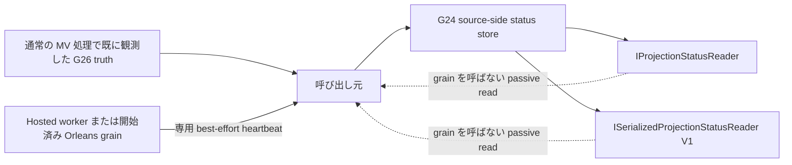

# マテリアライズドビュー基礎

> **ナビゲーション**
> - [コアコンセプト](01_core_concepts.md)
> - [はじめに](02_getting_started.md)
> - [コマンド・イベント・タグ・プロジェクター](03_aggregate_command_events.md)
> - [マルチプロジェクション](04_multiple_aggregate_projector.md)
> - [クエリ](05_query.md)
> - [コマンドワークフロー](06_workflow.md)
> - [シリアライゼーションとドメイン型登録](07_json_orleans_serialization.md)
> - [API実装](08_api_implementation.md)
> - [クライアントUI (Blazor)](09_client_api_blazor.md)
> - [Orleans構成](10_orleans_setup.md)
> - [ストレージプロバイダー](11_storage_providers.md)
> - [テスト](12_unit_testing.md)
> - [よくある問題と解決策](13_common_issues.md)
> - [ResultBox](14_result_box.md)
> - [バリューオブジェクト](15_value_object.md)
> - [デプロイガイド](16_deployment.md)
> - [コールドイベントとキャッチアップ](19_cold_events.md)
> - [マテリアライズドビュー基礎](20_materialized_view.md) (現在位置)

マテリアライズドビューは、DCB のイベントストリームから更新されるデータベース上のリードモデルです。Orleans の
メモリ状態だけに依存するのではなく、順序付けられたイベントを SQL テーブルへ反映し、そのテーブルを直接
クエリできるようにします。

## 何のために使うのか

マルチプロジェクションが DCB の標準的な読み取りモデルですが、次のような要件ではマテリアライズドビューが
向いています。

- 大きな一覧に対する SQL のページング・絞り込み・並び替え
- ダッシュボードや BI ツールなど、外部からのテーブル参照
- イベントストアとは別に最適化したインデックスを持つ読み取り用テーブル
- Grain の非アクティブ化とは独立して保持される DB リードモデル

アプリケーション内部だけで完結するならマルチプロジェクション、DB として公開したいならマテリアライズドビュー、
という使い分けが基本です。

## ランタイム構成

現在の実装は、共通 core と provider package に分かれています。

- `Sekiban.Dcb.MaterializedView`
  共通契約。`IMaterializedViewProjector`、`IMvInitContext`、`IMvApplyContext`、`MvRegistryEntry`、
  キャッチアップワーカーなどを含みます。
- `Sekiban.Dcb.MaterializedView.Postgres`
  PostgreSQL 向けのテーブル登録、レジストリ保存、イベント適用、行アクセス実装です。
- `Sekiban.Dcb.MaterializedView.SqlServer`
  SQL Server 向け classic MV 実装です。
- `Sekiban.Dcb.MaterializedView.MySql`
  MySQL 向け classic MV 実装です。
- `Sekiban.Dcb.MaterializedView.Sqlite`
  SQLite 向け classic MV 実装です。
- `Sekiban.Dcb.MaterializedView.Orleans`
  Orleans Grain による起動、状態確認、`IMvOrleansQueryAccessor` を提供します。

イベントの正本はあくまで DCB のイベントストアであり、マテリアライズドビューはその下流投影です。

イベントソースとマテリアライズドビューの書き込み先は独立した依存関係です。イベントソースには PostgreSQL、
Cosmos DB、DynamoDB、SQLite などの `IEventStore` 実装を使い、マテリアライズドビュー側は別の DB 接続・別の
provider をターゲットとして使えます。

## 全体の流れ

1. DCB のコマンドがイベントストアへイベントを書き込む
2. マテリアライズドビュー runtime がイベントストアから順序付きイベントを読む
3. プロジェクターがイベントを SQL 文へ変換する
4. レジストリが現在位置とアクティブバージョンを保持する
5. Orleans が stream 配信、バッファ、refresh を制御する
6. アプリケーションが DB テーブルをクエリする

つまり、整合性の中心は SQL テーブルではなく、順序付きイベント適用です。

## パッシブなプロジェクション状態

classic マテリアライズドビューの進捗は、既存の G24 `IProjectionStatusReader` と
`ISerializedProjectionStatusReader` から読み取れます。MV 専用 reader や target DB 側の status table は追加されません。
publisher はイベントソース provider（PostgreSQL、Cosmos DB、DynamoDB、SQLite）が提供する既存 status store へ書き込みます。



filter に使う正確な `ProjectorName` と `ProjectorVersion` は
`MvProjectionStatusIdentity.Create(viewName, viewVersion)` で取得します。この identity は記号や Unicode を含む名前でも
安定かつ衝突しません。worker / grain は、あらかじめ検証済みの正確な ServiceId をそのまま使用します。

写像は fail-closed です。

| G26 truth / lifecycle | G24 phase | `IsCaughtUp` の資格 |
| --- | --- | --- |
| `Unknown` | `unknown` | 常に不可 |
| Known + `Initializing` | `starting` | 常に不可 |
| Known + `CatchingUp` | `catchingUp` | 常に不可 |
| Known-zero/nonzero + `Ready` | `caughtUp` | G24 の freshness、remaining count、fault、conflict 条件もすべて満たす場合のみ |
| Known-zero/nonzero + `Active` | `active` | 同じ G24 条件をすべて満たす場合のみ |
| Known + `Retired` | `stopped` | 常に不可 |
| `Faulted` | `faulted` | 常に不可 |

Known-zero は `SortableUniqueId.MinValue` を保持し、`Unknown` には変換されません。publication は event apply、stream、query、
reader の hot path では実行されません。Hosted worker は catch-up cycle 後に publish し、Orleans は
`EnsureStartedAsync` の後でのみ専用 publisher timer を開始します。そのため status read は MV grain を activate しません。
書き込みは best-effort かつ独立 timeout 付きで、失敗診断は secret-free な固定メッセージです。publication の失敗はイベント適用や
query を停止させません。heartbeat が使うのは runtime がキャッシュした authoritative snapshot だけです。heartbeat と 2 種類の
G24 reader は、いずれもマテリアライズドビューの target DB を resolve、open、query しません。

## 登録方法

Orleans ホストでの基本的な登録例です。

```csharp
builder.Services.AddSekibanDcbMaterializedView(options =>
{
    options.BatchSize = 100;
    options.PollInterval = TimeSpan.FromSeconds(1);
});

builder.Services.AddMaterializedView<WeatherForecastMvV1>();

builder.Services.AddSekibanDcbMaterializedViewPostgres(
    builder.Configuration,
    connectionStringName: "DcbMaterializedViewPostgres",
    registerHostedWorker: false);

builder.Services.AddSekibanDcbMaterializedViewOrleans();
```

出典: `internalUsages/DcbOrleans.WithoutResult.ApiService/Program.cs`

役割は次の通りです。

- `AddSekibanDcbMaterializedView`
  共通オプション登録
- `AddMaterializedView<TView>`
  1 つのプロジェクター登録
- `AddSekibanDcbMaterializedViewPostgres`
  PostgreSQL 向けレジストリと executor の登録
- `AddSekibanDcbMaterializedViewSqlServer` / `AddSekibanDcbMaterializedViewMySql` / `AddSekibanDcbMaterializedViewSqlite`
  各 DB 向けの classic MV runtime 登録
- `AddSekibanDcbMaterializedViewOrleans`
  Orleans 側の起動と query accessor の登録

provider ごとの登録例:

```csharp
builder.Services.AddSekibanDcbMaterializedViewSqlServer(configuration, "DcbMaterializedViewSqlServer");
builder.Services.AddSekibanDcbMaterializedViewMySql(configuration, "DcbMaterializedViewMySql");
builder.Services.AddSekibanDcbMaterializedViewSqlite(configuration, "DcbMaterializedViewSqlite");
```

### ServiceId 単位のイベントソース

各マテリアライズドビューの catch-up worker は、空でない 1 つの ServiceId に固定します。1 プロセスで複数
サービスを動かす場合は provider の自動 worker を無効にし、サービスごとに immutable な worker を 1 つ登録します。

```csharp
builder.Services.AddSekibanDcbMaterializedView();
builder.Services.AddMaterializedView<WeatherForecastMvV1>();

// イベントソースと MV のターゲットは別 backend / 別 connection にできます。
builder.Services.AddSekibanDcbPostgres(sourceConnectionString);
builder.Services.AddSekibanDcbMaterializedViewPostgres(
    targetConnectionString,
    registerHostedWorker: false);

builder.Services.AddSekibanDcbMaterializedViewWorkerForService("orders");
builder.Services.AddSekibanDcbMaterializedViewWorkerForService("billing");
```

標準の PostgreSQL、Cosmos DB、DynamoDB、SQLite のイベントストア登録は `IEventStoreFactory` を提供します。
4 種類の classic MV target executor はイベントを読む前に `CreateForService(serviceId)` を解決するため、同じ
source backend を共有するサービス同士でもイベントが混ざりません。独自のイベントソースは、互換性のために
残されている `IEventStore` を受け取る executor コンストラクターを使えますが、ServiceId は明示してください。

Orleans の Grain key にも同じ ServiceId を含めます。`MvGrainKey.Build("orders", "WeatherForecast", 1)` で key を
作成すると、Grain は stream の準備や store アクセスより前にその ServiceId を検証し、executor へそのまま渡します。

単一サービスの旧構成で literal の `default` を使う場合だけ、明示的に opt-in します。

```csharp
builder.Services.AddSekibanDcbMaterializedView(options =>
{
    options.ServiceId = DefaultServiceIdProvider.DefaultServiceId;
    options.AllowDefaultServiceId = true;
});
```

通常の multi-service 登録で暗黙の `default` に依存しないでください。ServiceId が未指定、空白、default、または
呼び出し元と不一致の場合は、MV の infrastructure やイベントストアへの I/O より前に拒否されます。

プロジェクターは引き続き SQL を直接返します。複数 provider で 1 つの projector を使いたい場合は、
`ctx.DatabaseType` を見て SQL 方言を切り替えてください。Unsafe Window MV は v1 時点では PostgreSQL のみです。

## プロジェクターの書き方

マテリアライズドビューのプロジェクターは `IMaterializedViewProjector` を実装します。

```csharp
public sealed class WeatherForecastMvV1 : IMaterializedViewProjector
{
    public string ViewName => "WeatherForecast";
    public int ViewVersion => 1;

    public MvTable Forecasts { get; private set; } = default!;

    public async Task InitializeAsync(IMvInitContext ctx, CancellationToken cancellationToken = default)
    {
        Forecasts = ctx.RegisterTable("forecasts");
        await ctx.ExecuteAsync($"""
            CREATE TABLE IF NOT EXISTS {Forecasts.PhysicalName} (
                forecast_id UUID PRIMARY KEY,
                location TEXT NOT NULL,
                forecast_date DATE NOT NULL,
                temperature_c INT NOT NULL,
                summary TEXT NULL,
                is_deleted BOOLEAN NOT NULL DEFAULT FALSE,
                _last_sortable_unique_id TEXT NOT NULL,
                _last_applied_at TIMESTAMPTZ NOT NULL DEFAULT NOW()
            );
            """, cancellationToken: cancellationToken);
    }

    public Task<IReadOnlyList<MvSqlStatement>> ApplyToViewAsync(
        Event ev,
        IMvApplyContext ctx,
        CancellationToken cancellationToken = default) =>
        Task.FromResult<IReadOnlyList<MvSqlStatement>>([]);
}
```

出典: `internalUsages/Dcb.Domain.WithoutResult/MaterializedViews/WeatherForecastMvV1.cs`

責務は 2 つです。

- `InitializeAsync`
  論理テーブル登録と `CREATE TABLE` / `CREATE INDEX` 発行
- `ApplyToViewAsync`
  1 イベントを 1 個以上の SQL 文へ変換

## 事前プロビジョニングしたスキーマとホスト所有 SQL ポリシー

初期化の既定値は、従来互換の `CreateOrEnsure` です。deployment migration などで DB オブジェクトを管理する
ホストは `VerifyOnly` を選択できます。

```csharp
builder.Services.AddSekibanDcbMaterializedView(options =>
{
    options.InitializationMode = MvInitializationMode.VerifyOnly;
    options.SqlStatementPolicy = MyHostSqlPolicy.Instance;
});
```

verify-only は projector の初期化経路へ入る前に、宣言的な contract から binding と必要 schema を導出します。
provider の専用 `IMvReadOnlyMvInspector` で catalog と registry を読むだけであり、
`IMvApplyHost.InitializeAsync`、`EnsureInfrastructureAsync`、通常の書込み接続、registration、transaction、commit
は fallback になりません。したがって deployment 側で framework の registry 2 テーブル、projector table、registry
binding row まで用意します。binding の不足や不一致は型付きエラーで停止し、自動 seed は行いません。zero-DDL の保証は
Sekiban が所有する接続の境界に限られ、任意の user/projector code はこのプロセス境界の外です。

VerifyOnly は schema gate 成功後も隔離されたままです。target checkpoint の capture、空履歴の catch-up、public refresh、
event apply は mutating command なので、public boundary で secret-free な型付き
`MvTransitionNotAllowedException` として拒否されます。activation と forced reverse は
`MvActivationFailureReason.TransitionNotAllowed` を返します。observation は正当な read のままです。registry の mutating API
へ到達せず、成功後の fallback write もありません。
executor と Orleans Grain は、この mode では通常の projector 初期化、subscription、refresh timer、書込み用 registry 接続を開始しません。
専用 inspector 自身が read-only 経路を選びます。SQLite は `Mode=ReadOnly`、PostgreSQL は
`default_transaction_read_only=on`、MySQL は read-only transaction session を使用します。SQL Server は専用の
inspection principal を使用し、standalone instance で `ApplicationIntent=ReadOnly` を強制能力として扱いません。
`MvOptions.SqlServerInspectionConnectionString` に独立した最小権限の inspection principal（例えば DML/DDL 権限を
持たない `db_datareader` 相当の database user と、`VIEW DEFINITION` など契約に必要な非書込み metadata 権限）を
設定します。この capability が未設定または確立できない場合、catalog inspection 前に
`UnsupportedProviderCapability` の型付き failure で停止します。registry entry、active pointer、catalog metadata は inspector
経由だけで読み取り、provider の catalog allowlist は read-only です。SQLite の metadata は書込みを伴う PRAGMA ではなく
table-valued PRAGMA catalog function を使い、取得可能な declared length、precision/scale、generated expression を導出します。

### VerifyAndExecute（事前プロビジョニング済み実行）

`VerifyAndExecute = 2` は、schema deployment を host が所有しつつ、事前に用意した database に対して通常の
materialized-view lifecycle を実行する mode です。`VerifyOnly` と同じ declarative schema verification を行いますが、
infrastructure の ensure、DDL、registry binding の seed は行いません。projector DML、checkpoint/status 更新、
active-pointer CAS は明示的な Enforced policy がある場合だけ許可されます。

```csharp
builder.Services.AddSekibanDcbMaterializedView(options =>
{
    options.InitializationMode = MvInitializationMode.VerifyAndExecute;
    options.SqlStatementPolicyMode = MvSqlStatementPolicyMode.Enforced;
    options.SqlStatementPolicy = MyHostSqlPolicy.Instance;
});
```

policy の未設定、`Legacy` policy mode、互換 allow-all policy は、store/source/connection/projector より前に型付き
`MvVerifiedExecutionConfigurationException` になります。未知の numeric mode も作業前に fail-closed です。

| Mode | schema verify | ensure / DDL / registry seed | projector DML | lifecycle DML |
| --- | --- | --- | --- | --- |
| `CreateOrEnsure` (0) | なし | 可 | 可 | 可 |
| `VerifyOnly` (1) | あり | 不可 | 型付き拒否 | 型付き拒否 |
| `VerifyAndExecute` (2) | あり | 不可 | `Enforced` + 明示 policy 時のみ可 | `Enforced` + 明示 policy 時のみ可 |

PostgreSQL では object を owner/migration role で provision し、runtime role には必要な DML と catalog visibility
だけを grant します。schema の CREATE と object ownership は grant しません。通常は schema の `USAGE` と、MV および
framework registry table への `SELECT` / `INSERT` / `UPDATE` / `DELETE`（必要なら sequence usage）だけを付与し、
`CREATE` / `ALTER` / `DROP` は拒否します。integration proof は実際にこの DDL-denied role を使い、3 つの DDL verb の
negative control も確認します。evidence には connection string、password、SQL value などの secret を出力しません。

mode 2 は最初の projector DML / registry command より前に apply batch 全体を collect して authorize します。policy deny の
場合は view row、registry checkpoint/status、active pointer が変わりません。将来の実装が authorization より先に実行すると、
この deny test は red になります。

verify-only に対応する projector は、format version `1` の追加された `MvSchemaContract` /
`IMvSchemaRequirementsProvider` 契約で target schema を宣言します。

```csharp
public IReadOnlyList<MvSchemaTableRequirement> GetSchemaRequirements(
    MvDbType databaseType,
    IMvTableBindings tables) =>
[
    new(
        "forecasts",
        tables.GetPhysicalName("forecasts"),
        [
            new("forecast_id", MvSchemaTypeFamily.Guid, false),
            new("location", MvSchemaTypeFamily.String, false),
            new("forecast_date", MvSchemaTypeFamily.DateTime, false),
            new("temperature_c", MvSchemaTypeFamily.Integer, false),
            new("summary", MvSchemaTypeFamily.String, true)
        ],
        ["forecast_id"])
];
```

verifier は mismatch を deterministic な順序で全件報告します。type、nullability、primary key に加えて、正規化した
default、必要な index（列順と unique 性）、generated column の意味と式、文字列サイズ、numeric の precision / scale も contract で表現できます。
provider-neutral な検証は PostgreSQL、MySQL、SQL Server、SQLite の native metadata へそれぞれ変換して実行されます。
table / column の不足、type・nullability・key・metadata の不一致、schema contract
不足、metadata capability 非対応は、型付き `MvInitializationException` と `MvInitializationFailureReason` になります。
これらは event read、view write、registry mutation、catch-up、activation より前に発生します。そのため schema contract
を実装していない host も verify-only では fail-closed になります。

互換性の proof には公開済み `10.14.1` package を参照して restore / build した binary consumer を含めています。
branch の assembly を出力先へ差し替えた後、再コンパイルなしで実行します。詳細は
[`Sekiban.Dcb.MaterializedView.BinaryConsumer`](../../dcb/tests/Sekiban.Dcb.MaterializedView.BinaryConsumer/README.md) を参照してください。

projector が返すすべての initialization / apply SQL 文は、provider 実行前に host 所有の
`IMvSqlStatementPolicy` へ渡されます。`MvSqlStatementContext` には正確な service id、view name / version、
`Initialization` または `Apply` phase、正確な `ProjectorInitialize` / `ProjectorApply` / `ProjectorQuery` origin、
provider の `DatabaseType`、logical / physical table binding、SQL text、parameter metadata が含まれます。
policy は optional な rule id を付けて `MvSqlPolicyDecision.Allow(ruleId)` または `Reject(reason, ruleId)` を返せます。

```csharp
public sealed class MyHostSqlPolicy : IMvSqlStatementPolicy
{
    public static MyHostSqlPolicy Instance { get; } = new();

    public ValueTask<MvSqlPolicyDecision> EvaluateAsync(
        MvSqlStatementContext context,
        CancellationToken cancellationToken = default) =>
        ValueTask.FromResult(
            context.Phase == MvSqlStatementPhase.Initialization
                ? MvSqlPolicyDecision.Reject("Initialization SQL is migration-owned.")
                : MvSqlPolicyDecision.Allow());
}
```

拒否は型付き `MvSqlPolicyRejectedException` になります。safe failure には service / view / version、phase、正確な origin、
provider、rule id、statement index / batch size、SQL fingerprint が含まれますが、SQL や parameter value はコピーされません。
initialization の拒否は `EnsureInfrastructureAsync` や provider command より前に起きます。apply の拒否は projector SQL や
registry checkpoint を commit する前に event transaction を rollback します。
`Legacy` mode では既存の raw `Connection` / `Transaction` access を source-compatible に維持します。SQL 境界を強制する
host は `Enforced` mode を選びます。

```csharp
options.SqlStatementPolicyMode = MvSqlStatementPolicyMode.Enforced;
```

Enforced mode は `QueryRowsAsync`、`QuerySingleOrDefaultAsync`、`ExecuteScalarJsonAsync` の provider port の前で policy を
評価し、raw connection / transaction を projector に公開しません。initialization / apply batch は最初の SQL を実行する前に
全 statement を preflight します。`VerifyAndExecute` では event batch 全体の all-or-nothing boundary も追加されます。policy の未登録、fault、invalid decision、deny は typed reason 付きで fail-closed し、
cancellation は `OperationCanceledException` のままです。runtime は SQL の先頭 keyword で判断しないため、mutating CTE、comment、
multi-statement text の許可可否は host の allowlist が決めます。

hosted worker も同じ中央 initialization gate を使います。verify-only では verification failure を faulted status として公開し、
retry interval 後に再試行します。verification 成功後は mutating catch-up lifecycle に入らず停止します。ensure mode へ fallback しません。

### dcb-v10.15.0 migration note

以前に zero work で成功したように見えた `VerifyOnly` の command call は、型付き failure になります。事前プロビジョニング済み
worker を実行したい host は、意図的に `VerifyAndExecute` へ移行し、Enforced の non-allow-all policy と DML 限定の
database role を設定してください。既存の `CreateOrEnsure`、CLR method signature、enum value 0/1 は変更しません。

package の既定値は `CreateOrEnsure`、`Legacy`、`MvAllowAllSqlStatementPolicy` のままであり、新しい境界を選ばない既存 caller の
動作を維持します。

## 順序保証と冪等性

マテリアライズドビューはリプレイ可能である必要があります。基本パターンは次の通りです。

- 各行に `_last_sortable_unique_id` を持つ
- 受信イベントの sortable id が新しいときだけ更新する
- 順序の正本は event store とする

例:

```sql
UPDATE some_table
SET value = @Value,
    _last_sortable_unique_id = @SortableUniqueId
WHERE id = @Id
  AND _last_sortable_unique_id < @SortableUniqueId;
```

これにより、catch-up と stream 適用が最終的に同じ状態へ収束できます。

## レジストリで管理するもの

ランタイムは logical table ごとに次の運用情報を保持します。

- service id
- view name / active version
- logical table 名と物理 table 名
- current position / last sortable unique id
- 適用済みイベント数
- stream 側 / catch-up 側の最終適用 sortable id

`MvRegistryEntry.CurrentCheckpointTruth` と `TargetCheckpointTruth` がチェックポイントの正本です。それぞれは明示的な
`Known` / `Unknown` 状態と provenance（適用したイベント、権威的な空履歴など）を持ちます。known zero は
`SortableUniqueId.MinValue` で表し、unknown とは別の状態です。nullable の `CurrentPosition` / `TargetPosition` は
ソース互換性と legacy 行の表示のために残っていますが、それだけで readiness や順序を判定することはありません。

4 つの relational provider はチェックポイント列を追加して正本を保存し、既存の registry 行を失わずに migration
します。legacy の null は `Unknown(LegacyNull)` として復号されます。シリアライズされた truth が不正なら型付きの
`MvCheckpointMalformedException` を返し、どちらかが unknown または malformed の比較・readiness 判定は fail closed
になります。

用途は次の通りです。

- 現在有効な物理テーブルの解決
- 運用向け status 表示
- catch-up 中か ready か active かの判断

### 権威的な activation（SEK-G27）

MV の初期化が成功したことや active 行が存在しないことだけでは、version を active にしません。activation の境界で
まず event store の head を `Known` target として取得し、`MvCheckpointProvenanceKind.AuthoritativeTargetCapture` の
provenance を付けます。その後、candidate は service/view/version の identity、`Ready` lifecycle、`Known` の current と
target、legacy ではない provenance、current が取得済み target 以上であることを満たす必要があります。Unknown、malformed、
stale、behind、faulted、unsafe な candidate は型付き拒否となり、active pointer を変更しません。G24 の sampled status や
event count は診断情報に過ぎず、cutover の証拠には使いません。

4 つの relational registry store は `TryActivateAsync` を提供します。この操作は provider の 1 transaction 内で、期待する
active version と単調増加する generation、さらに candidate の checkpoint snapshot 全体を比較します。競合または superseded
された試行は型付き conflict を返し、以前の pointer を保持します。初回 activation も同じ capture、eligibility、
compare-and-switch 経路を通るため、active 行がないことは許可ではなく、比較対象の一つに過ぎません。

### 並行 generation、切替、rollback（SEK-G29）

`IMvGenerationCoordinator` は、厳密な 1 つの `(service, view)` ごとに generation の準備と切替を調停します。N+1 の
準備には既存の version 別 apply engine を使い、active な N を clear したり checkpoint を共有したり停止したりしません。
通常の forward / reverse は `SwitchAsync` だけを使い、SEK-G27 の権威的 eligibility と provider の atomic な
active-version/generation compare-and-switch を通ります。失敗、stale、競合した要求では active pointer は変わりません。
以前の generation と物理 table は診断と、eligible な通常 reverse のために保持されます。

通常 read の `MvOrleansQueryAccessor.GetAsync` は操作開始時に active pointer を 1 回解決し、その version の entries と
Orleans grain を返します。明示的な version 診断だけは別名の `GetPinnedAsync` を使います。`GetAsync` に渡す projector の
version で通常の active routing を上書きすることはできません。

break-glass rollback は別 API の `ForceReverseAsync` です。reverse 専用で、免除できるのは checkpoint の freshness/truth
だけです。保持した version は厳密な service/view/version identity で存在し、安全な `Ready` lifecycle である必要があり、
期待する active version と generation は引き続き atomic に fence されます。forced switch は `switch_kind=forced`、operator
が指定した reason、timestamp を永続化します。この metadata は lifecycle publication seam から既存の G24 typed / V1
serialized observation へ push され、read 時に MV target database を open/query しません。通常 API に forced-forward の
flag や mode はありません。

## テーブルのクエリ方法

物理テーブル名をアプリ側で決め打ちしないでください。`IMvOrleansQueryAccessor` を使って解決します。

```csharp
var context = await mvQueryAccessor.GetAsync(projector);
var forecastEntry = context.GetRequiredTable("forecasts");

await using var connection = new NpgsqlConnection(context.ConnectionString);
await connection.OpenAsync();

var rows = await connection.QueryAsync<WeatherForecastMvRow>(
    $"SELECT * FROM {forecastEntry.PhysicalTable} WHERE is_deleted = FALSE");
```

query context から取得できるもの:

- `DatabaseType`
- `ConnectionString`
- `Entries`
- `Grain`

`Grain` は status 確認や、ある `SortableUniqueId` が受信済みかどうかの待機にも使えます。

## マルチプロジェクションとの違い

| 観点 | マルチプロジェクション | マテリアライズドビュー |
| --- | --- | --- |
| 保存先 | Orleans Grain 状態 | SQL テーブル |
| 読み取り経路 | `ISekibanExecutor.QueryAsync` | SQL / Dapper / DB アクセス |
| 向いている用途 | アプリ内部の読み取りモデル | 一覧、レポート、外部参照 |
| 最新性制御 | `WaitForSortableUniqueId` | Grain status + SQL 読み取り |
| スキーマ管理 | 投影 payload | 明示的な table DDL |

両者は排他的ではなく、同じサービスで併用できます。

## 現在のスコープ

現時点の実装範囲:

- DB backend: PostgreSQL、SQL Server、MySQL、SQLite
- 実行ホスト: Orleans
- イベントの正本: ServiceId 単位で解決する既存の DCB event store

サンプル実装 `internalUsages/DcbOrleans.WithoutResult.ApiService` では、

- イベントストアは Postgres
- マテリアライズドビュー用テーブルも別 Postgres 接続で管理
- Orleans が status、buffering、refresh を制御

という構成になっています。

## 実務上の指針

- 最初は 1 projector / 1 logical table から始める
- 行スキーマは明示的かつ単純に保つ
- `_last_sortable_unique_id` は必ず持つ
- 公開するクエリ形に合わせて index を張る
- テーブル定義や投影ロジック変更時は `ViewVersion` を上げる
- 正本は event store であり、マテリアライズドビューは再構築可能にしておく

<!-- sek-g44:mv-production-guidance -->
## DCB template の本番既定値

DCB template は `MvOptions.InitializationMode` を意図的に設定しません。library の既定値は
`CreateOrEnsure` であり、template 固有の mode や test seam を追加せず、新しく生成した application を
初回起動で利用できる状態にします。ただし、これは本番の schema 変更が自動で安全になるという意味ではありません。
`VerifyOnly` が必要な operator は、target schema を事前に provision し、初回起動の利便性を手放すことを
受け入れた上で明示的に選択してください。この運用上の選択は template の既定値を変えるのではなく、application の
deployment policy に置きます。

## 関連資料

- [マルチプロジェクション](04_multiple_aggregate_projector.md)
- [クエリ](05_query.md)
- [ストレージプロバイダー](11_storage_providers.md)
- `internalUsages/Dcb.Domain.WithoutResult/MaterializedViews/WeatherForecastMvV1.cs`
- `internalUsages/DcbOrleans.WithoutResult.ApiService/Program.cs`
