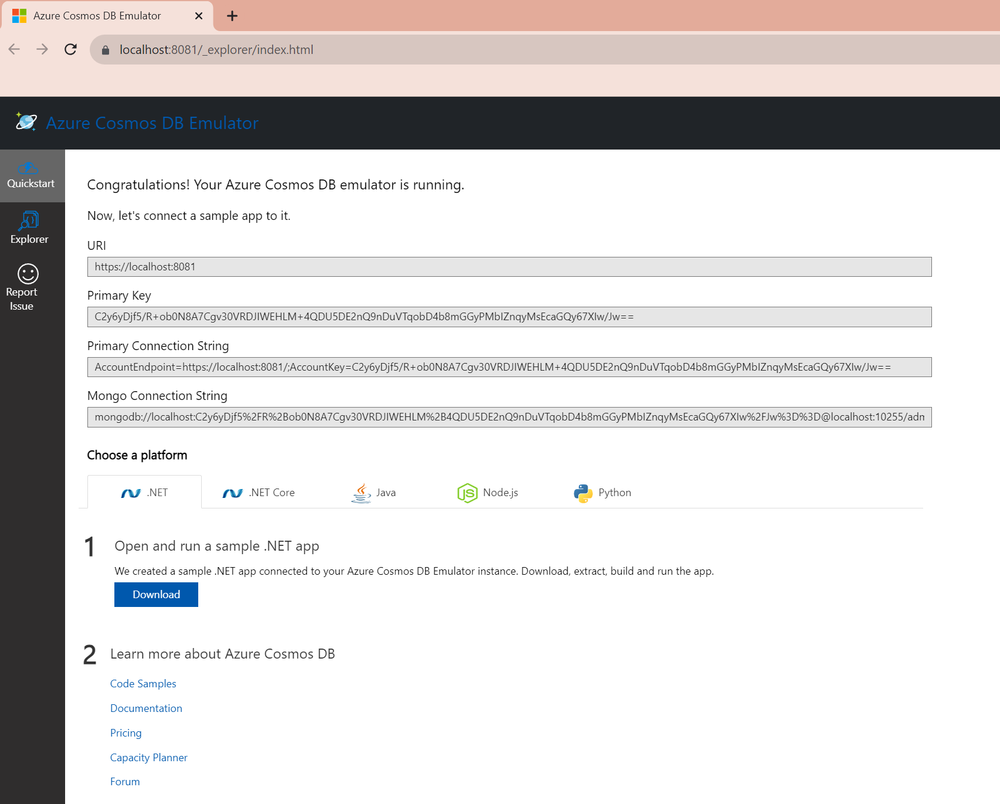

# Prepare Cosmos DB with Local

## Local Emulator.

You can easily install Local Emulator on Windows. Microsoft provides docker image for the cosmos db emulator, on macOS or Linux, it does need SSL/TSL settings, and we have not tried it yet. When we use in macOS, we use Azure Cosmos DB.

For windows, first install Cosmos DB Emulator.
[Download from Microsoft Learn Website](https://learn.microsoft.com/en-us/azure/cosmos-db/emulator-release-notes)

After instllation, you can launch `Azure Cosmos DB Emulator`. On version `2.14.2` of Cosmos DB Emulator, we did not need to launch with special preview mode to use Hierarchical Partition Key.

When you launch Azure Cosmos DB Emulator, you can access from windows task bar icons. You can click the Cosmos DB planet icon and click `Open Data Explorer`

In the Data Explorer, open Quickstart and copy following information.

- **URI**
- **Primary Key**

Those information will use when you test the application.