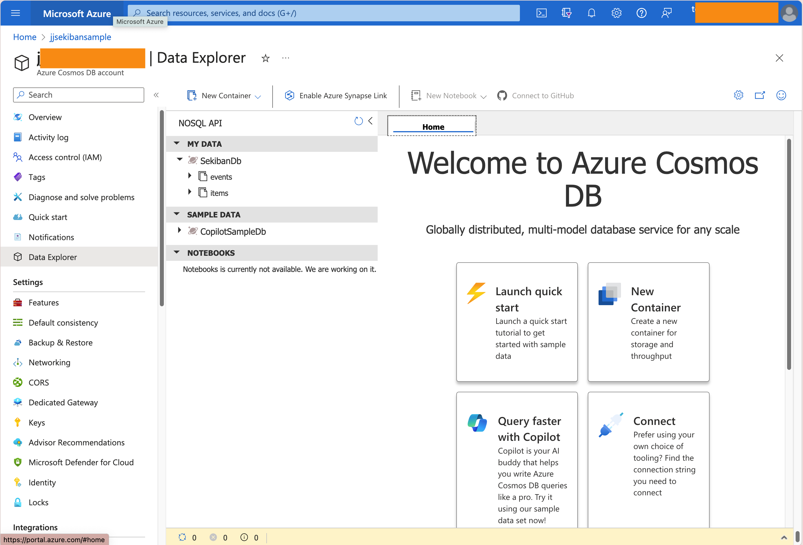

# Quick Start


## Test it out.

To start quickly, we recommend you to start testing sekiban with already set up get started project.
It is located in the repository, `/Samples/Tutorials/1.GetStarted` folder.

### Open GetStarted Solution.


Get Started Project is made with .NET 7.There is multiple way to test it out GetStarted Solution


1. Using Cosmos DB  [Test out with Cosmos DB](./test-out-cosmos.md).
2. Using Dynamo DB  [Test out with Dynamo DB](./test-out-dynamo.md).


### Create your own Sekiban Project.

Do make your own project, usually you need three projects.

To make your own project, you can refer Tutorial Project in `/Samples/Tutorials/1.GetStarted` folder.

1. `Domain Project`. This project is usually only includes Aggregate, Command, Event, Projection, Query etc. core event sourcing contents.

    `Domain Project` will add `Sekiban.Core` Nuget Package.

    `Domain Project` includes  Aggregate, Command, Event, Projection, Query etc.

    `Domain Project` includes `Domain Dependency Definition`.

2. `Test Project`. This project tests Domain Project.

    `Test Project` will reference `Domain Project`.
    `Test Project` will add `Sekiban.Testing` Nuget Package.

    `Test Project` will include `Aggregate Test` and/or `Unified Test`.

3. `Executing Project`. This project is either console application, web application, function application or any other executing application form. In many cases, it is Web API interface to access `Domain Project`.

    `Executing Project` will reference `Domain Project`.

    `Executing Project` will add Infrastructure project. Currently Sekiban supports `Azure Cosmos DB` and `AWS Dynamo DB`.

    If `Executing Project` will use Azure Cosmos DB, add `Sekiban.Infrastructure.Cosmos` Nuget package.

    If `Executing Project` will use AWS Dynamo DB, add `Sekiban.Infrastructure.Dynamo` Nuget Package.

    When `Executing Project` will be `Web API Project that uses Sekiban.Web API Generator`, it will includes following items.
    
    - Add `Sekiban.Web` Nuget Package.
    - `Web Dependency Definition` that inherits IWebDependencyDefinition.
    - `Program.cs` will have `AddSekibanCoreWithDependency` as Sekiban.Core Settings.
    - `Program.cs` will have `AddSekibanCosmosDB` as Infrastructure Settings.
    - `Program.cs` will have `AddSekibanWeb` as Web Settings.

    - `appsettings.json` will needs basic settings.


#### appsettings.json for Azure Cosmos DB.
Below is minimum setting for the Cosmos DB. You can obtain Cosmos DB connection string from Cosmos DB website or azure cli. `CosmosDbDatabase` should be database name you use, container name can be define with appsettings but it uses `events` for events, and `items` for commands and snapshots.
```json
{
  "Logging": {
    "LogLevel": {
      "Default": "Information",
      "Microsoft.AspNetCore": "Warning"
    }
  },
  "ConnectionStrings" : {
    "SekibanCosmos" : "[Set your cosmos db connection string]",
    "SekibanBlob": "[Set your blob connection string here. (not necessary for just running the sample)]"
  }
}
```

With this simple way of the settings, sekiban will connect to following Cosmos Db instances.
- Azure Cosmos DB Endpoint : one you set on "ConnectionStrings:SekibanCosmos"
- Azure Cosmos DB Database : Default Database Name "SekibanDb", also you can set on appsettings by "Sekiban:Default:Azure:CosmosDatabase" 
- Azure Cosmos DB Container : Two container will be needed.
  - 1. "events" container. Stores all events.
  - 2. "items" container.

It looks like following image.



#### appsettings.json for Dynamo DB.
Below is minimum setting for the Dynamo DB. Table names `DynamoEventsTable` `DynamoItemsTable` can be define with appsettings but it uses `events` for events, and `items` for commands and snapshots.
```json
{
  "Logging": {
    "LogLevel": {
      "Default": "Information",
      "Microsoft.AspNetCore": "Warning"
    }
  },
  "Sekiban": {
    "Default": {
      "Aws" : {
        "DynamoRegion": "us-east-1",
        "AccessKeyId": "[Set your dynamo db access id here]",
        "AccessKey": "[Set your dynamo db access key here]",
        "DynamoItemsTable": "jjlt_items",
        "DynamoEventsTable": "jjlt_events",
        "S3BucketName": "jjlt-s3",
        "S3Region": "us-west-1"
      }
    }
  }
}
```

Those are basic Project Settings. Detail information will follow with  [Sekiban Event Sourcing Basics](./sekiban-event-sourcing-basics.md).