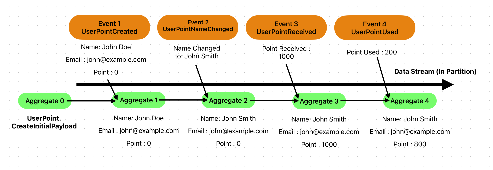
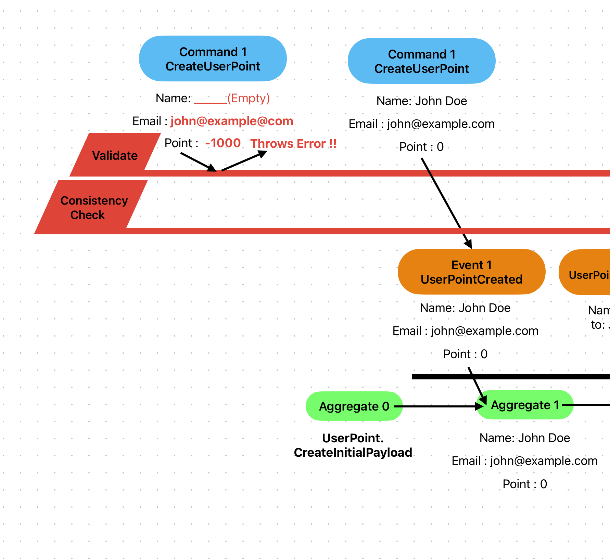

# Sekiban Event Sourcing Basics

## Basics of Event Sourcing.

Basic concept of Event Sourcing is, source of truth is always in the events and state can be calculated from stream of events. Events is append only and should contain what happened as events, preferbly contains why that happened as well.

## Source of the events - stream.

And for event sourcing, first concept you need to understand is stream of events. Events are grouped with `Partition`, and one `Partition` has multiple events and make state. We call this grouping as `Aggregate`. In Sekiban, `Aggregate` has types and has set of events. `Aggregate` manages its state after each events. It is explaining in image below.



This image shows how aggregate is changed with stream of events.

1. Event1 create user John Doe, john@example.com and 0 point.
2. Event2 Changes names to John Smith. Aggregate name is changed but email and point are still same from last state.
3. Event3 adds point 1000. Aggregate name and email stays same and point are added 1000 and current point become 1000.
4. Event4 uses point 200. Aggregate name and email stays same and point reduces 1000 minus 200, current point becomes 800.

Like this image and explains, you can define aggregate and events, and event will change state of aggregate. In Sekiban, we can define Aggregate and Event as below.

This is from SekibanEventSourcingBasics Tutorial, located in the repository, `/Tutorials/1.SekibanEventSourcingBasics` folder.

```csharp
   public record UserPoint(string Name, string Email, int Point) : IAggregatePayload<UserPoint>
   {
    // Aggreagte 0
       public static UserPoint CreateInitialPayload(UserPoint? _) => new UserPoint(string.Empty,string.Empty,0);
   }

   public record UserPointCreated(string Name, string Email, int Point) : IEventPayload<UserPoint, UserPointCreated>
   {
    // Aggregate 1 = f(aggregate0, event1)
       public static UserPoint OnEvent(UserPoint aggregatePayload, Event<UserPointCreated> ev) =>
           new(ev.Payload.Name, ev.Payload.Email, ev.Payload.Point);
   }

   public record UserPointNameChanged(string ChangedName) : IEventPayload<UserPoint, UserPointNameChanged>
   {
    // Aggregate 2 = f(aggregate1, event2)
       public static UserPoint OnEvent(UserPoint aggregatePayload, Event<UserPointNameChanged> ev) =>
           aggregatePayload with { Name = ev.Payload.ChangedName };
   }

   public record UserPointReceived(int Point, string Note) : IEventPayload<UserPoint, UserPointReceived>
   {
    // Aggregate 3 = f(aggregate2, event3)
       public static UserPoint OnEvent(UserPoint aggregatePayload, Event<UserPointReceived> ev) =>
           aggregatePayload with { Point = aggregatePayload.Point + ev.Payload.Point };
   }

   public record UserPointUsed(int Point, string Note) : IEventPayload<UserPoint, UserPointUsed>
   {
    // Aggregate 4 = f(aggregate3, event4)
       public static UserPoint OnEvent(UserPoint aggregatePayload, Event<UserPointUsed> ev) =>
           aggregatePayload with { Point = aggregatePayload.Point - ev.Payload.Point };
   }

```

Code above is simple yet shows how you can define event sourcing stream.
This case aggregate (stream) is named `UserPoint`. In this `UserPoint` stream manages ONE User with Point. If two Users exists, it should use two different stream.

You can see from the code above, this code represents AggregatePayload and EventPayload. There are common information for the Aggregate and Events, which is AggregateId, TimeStamp, SortKey, PartitionKey etc is in the Aggregates and Events, and developer will write code for the contents, in the Payload.

One important restriction is, event can never throw exception. It will be used whole time when system is runnning, as the way to build aggregate state. If wrong event are sent wrong time, you can just not change aggregate and return.

### "Functional" way to write event sourcing.
The code above is live code that can run in the Sekiban, it might be slightly different with what you see in other event sourcing library or sample code. Sekiban took event sourcing as "Functional" way and try to use c# feature of the functional side. IAggregatePayload Interface method "CreateInitialPayload" and IEventPayload "OnEvent" method are both static and pure function, which is not changing instance, rather create new instance and returns as a new object. This makes it more compatible for parallel executions and easier to see code base. 


## Only way to Produce Event - Command.

List of Events and states created with Events are most fundamental part of Sekiban. But also `Commands` has big part of the event sourcing. In Sekiban and in general Event Sourcing, `Command` is the one creates events. 

`Command` should include following features.
- Determine which stream Events are written (AggregateId).
- Data Validation
- Consistency Check.
- Generate Events.

And `Command` has two main part of it.
1. Command Data (Usually called `Command`) - Order contents, it usually send from user. Some cases, system can send command for a aggregate (stream) as well.
    Commands will need to detarmine which stream Events are written by returning Guid Value on `GetAggregateId();`
    In Sekiban, validation attribute takes care of most part of validations that you can define its restrictions.

2. Command Handler - Function or Program that take care the Order (Command.) Handler takes care of Consystency Check and making event(s) to save.

This is sample Command for CreateUserPoint and ChangeUserPointName

```csharp
public record CreateUserPoint(
    [property: Required]string Name, 
    [property:Required, EmailAddress]string Email,
    [property:Range(0,10000)] int Point) : ICommand<UserPoint>
{
    public Guid GetAggregateId() => Guid.NewGuid();

    public class Handler : ICommandHandler<UserPoint, CreateUserPoint>
    {
        public IEnumerable<IEventPayloadApplicableTo<UserPoint>> HandleCommand(Func<AggregateState<UserPoint>> getAggregateState, CreateUserPoint command)
        {

            // can check if email is already registered in the system

            yield return new UserPointCreated(command.Name, command.Email, command.Point);
        }
    }
}
```

``` csharp
public record ChangeUserPointName(
    [property: Required] Guid UserPointId,
    [property: Required] string NameToChange) : ICommand<UserPoint>
{
    // Aggregate Id should be current aggregate.
    public Guid GetAggregateId() => UserPointId;

    public class Handler : ICommandHandler<UserPoint, ChangeUserPointName>
    {
        public IEnumerable<IEventPayloadApplicableTo<UserPoint>> HandleCommand(Func<AggregateState<UserPoint>> getAggregateState, ChangeUserPointName command)
        {
            // consistency check.
            if (command.NameToChange == getAggregateState().Payload.Name)
                throw new InvalidOperationException("Already have same name as requested.");
            
            yield return new UserPointNameChanged(command.NameToChange);
        }
    }
}
```




The code above has two main classes.
- CreateUserPoint,CreateUserPoint : Command Data Class.

    In Sekiban, comand has responsibility to decide which `Aggregate Id` the stream should save. Stream will be partition with `AggregateId` and `Aggregate Type`. (Actually it has one more key `RootPartitionKey` but it will be explain in other documents.) Since command already has which `Aggregate Type`, command need to determine `Aggregate Id`. 
    This can be done with returns Guid value on `GetAggregateId()`. If you want to create new stream, you can return `Guid.NewGuid()` to create unique Guid. That is why CreateUserPoint Command returns `GetAggregateId() => Guid.NewGuid().`. On the other hand, to execute CreateUserPoint command, it should refer Aggregate Id that already exists, so CreateUserPoint has property `UserPointId` which will be used in the `GetAggregateId()`.

    Validation is also important role of the Command. In this sample, commands has `[property : Required]` or `[property : EmailAddress]`. Those validation attributes will be execute before command handler, it helps to not adding wrong data into the system. Any other complecated validation can do within Handler methods as well.

- CreateUserPoint.Handler, CreateUserPoint.Handler : Command Handler Class.

    Command Handler can check if command can run this command. It is no problem command throws exception when wrong command is sent. (Event is something already happend but command is something we should try in future, so it could have failed in some situations.) Command handler will allow to have DI from dotnet, and Sekiban Command Handler method can be sync/async you can choose which one for each command. Then you can sometime run query etc to detarmine if you can allow to run commands.

    When consistency test has passed, you can generate event. Event is something system already allowed, so it will be handled with the fact. 

### Event and Command Naming.

Because of what we dicsussed in this document, naming of the event, command will be following.

- **Event** : Past Sentense like `UserCreated` or `NameChanged`
- **Command** : Order term like `CreateUser` or `ChangeName`

