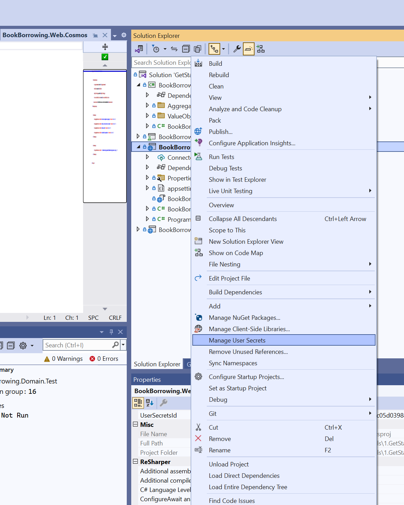
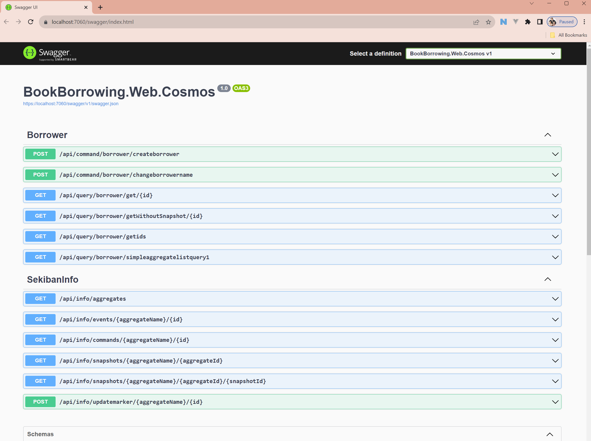
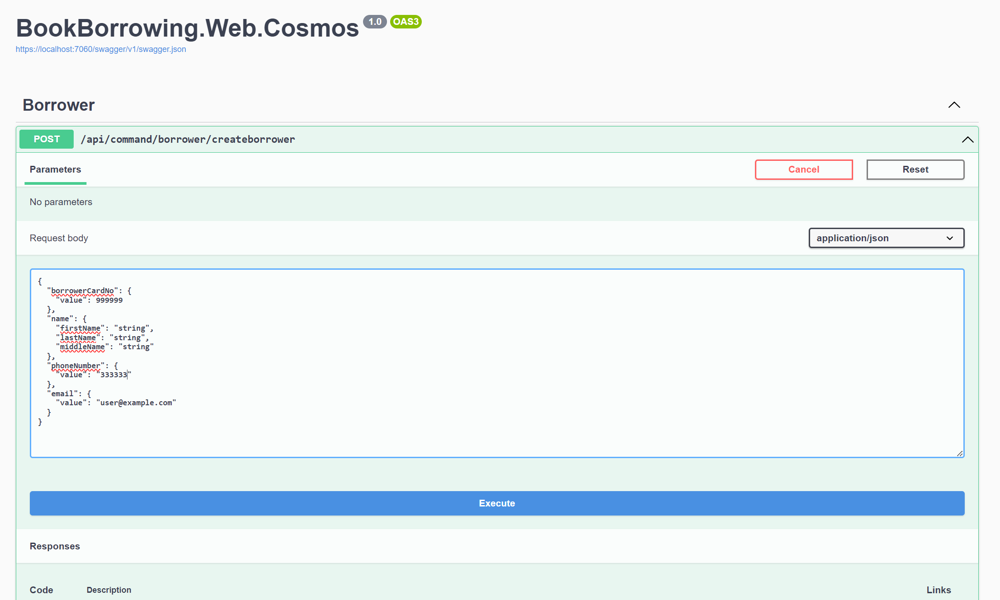
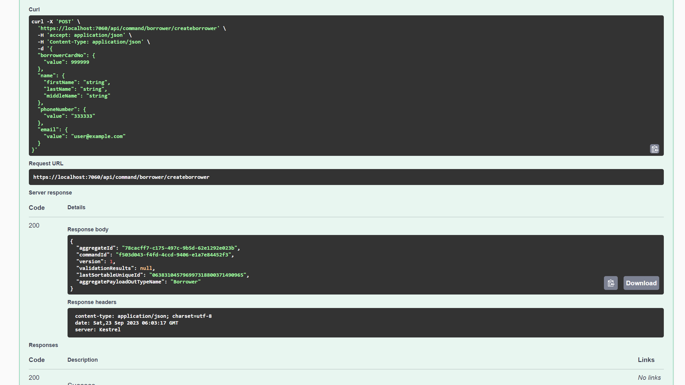
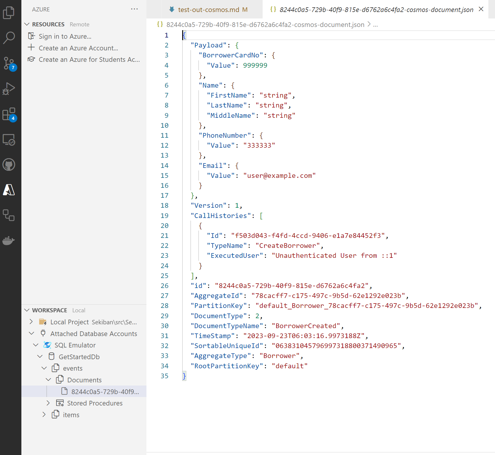

# Test GetStarted Solution with Cosmos DB

To test GetStarted solution, you need to have Cosmos DB. 

## Prepare for the Cosmos DB

You can use either local emulator or use Azure Cosmos DB. Sekiban uses new [Hierarchical Partition Key](https://learn.microsoft.com/en-us/azure/cosmos-db/hierarchical-partition-keys?tabs=net-v3%2Cbicep) feature for the Cosmos DB, so developer needs to be aware to use correctly.

Either way you used, you need to get following information.

- **URI**
- **Primary Key**

For Local Emulator in Windows, please see [This Page](./prepare-cosmos-db-local.md)

For Azure Cosmos DB, please see [This Page](./prepare-cosmos-db-azure.md)

When you prepare Cosmos DB, note yourself privately the **URI** and **Primary Key**.

## Prepare for Blob Storage (Optional)

Sekiban uses blob storage for following data.

- Aggregate Snapshot when size is big. 

    Azure Cosmos DB has 4MB data limit, but to be safe not to hit limit, sekiban will make snapshot blob when payload json is about to hit 1MB.

- Projection Snapshot.
    
    Projection snapshot is always created in the blob storage but default setting has set not to make snapshot below 3000 events.

Because case that uses blob is rare in the getting started level of the data, you don't need to create blob storage for getting started project. 

There is many way you can execute solution.

1. Visual Studio 2022
2. Command Line (dotnet commands) - Visual Studio Code or other editor.
3. JetBrains Rider.

Sekiban can be developed with all those application, but first, we explain using visual studio 2022.

### Open Solution and set URI and Primary Key Using Visual Studio 2022

Install Visual Studio 2022. It should be 17.7 or higher version.(dotnet 7 compatible.)

1. Open `/Tutorials/1.GetStarted/GetStarted.sln`

2. Right Click on `BookBorrowing.Web.Cosmos` Project and Select `Manage User Secrets`
    



3. Edit User Secrets and write following information.

```json
{
  "Sekiban": {
    "Default": {
      "BlobConnectionString": "[Set your blob connection string here. (not necessary for just running the sample)]",
      "CosmosDbEndPointUrl": "write your URI",
      "CosmosDbAuthorizationKey": "write your primary key"
    }
  }
}
```

if URI and Primary Key was correctly set, you can run Sekiban Web API.

### Execute Web Project and Command using Visual Studio 2022.

1. Set `BookBorrowing.Web.Cosmos` as startup project and Debug Execute project.

If program runs correctly, you will see following website.



2. Execute `createborrower` command.

You can click `createborrower` command and press `Try Out` button.
You nee to change phonenumber.value to number (more than 6 digits.) and `Execute` command.



If command return with 200 (Success), you have succeeded to execute command!



You can copy aggregate Id from result.

It is Guid value, it should always have different id when created new aggregate, but it will share through out same aggregate id. In this case, aggregate Id was `78cacff7-c175-497c-9b5d-62e1292e023b`

### Check saved data in Cosmos DB.

#### Local Emulator.

Cosmos DB Emulater `2.14.2` can create hieralchical partition key data from sekiban, but Data Explorer can not display json data that saved. It looks like it still have old front end.

To display data, I could use `Azure Databases Extension for VS Code.`

You can get information from [Cosmos DB Website](https://developer.azurecosmosdb.com/tools)

After you install on Visual Studio Code, you can Click "A" icon from left side bar and open Azure Databases Extension. In the "Workspace" area, there is the `Attached Database Accounts` - `Attach Emulator` button. You can select `Core (SQL)` and connect to local emulator.

You can select `GetStartedDb` - `Events` - `Documents` and if you have one data that created with first command, you are succeeded!.

Note : Maybe this extension is still have many bugs too. I could not get data updated, unless right click `SQL Emulator` and `Detach` to Detach Emulator and Attach again.



#### Azure Cosmos DB.

In Azure Cosmos DB, you can go to DataExplorer and Find `GetStartedDb` - `Events` - `Items` and you should be able to find data you created with first command. JSON should be same that you can see from local emulator.

### Query from Sekiban.

Sekiban Web also has query feature. You can get one aggregate or list Aggregate from Sekiban Web.

#### Get List of Aggregate.

Run `BookBorrowing.Web.CosmosDB` again and select `/api/query/borrower/simpleaggregatelistquery1` and `Try Out` - `Execute`. You don't need to change input value.

You can see list of aggregate (which this time only one aggregate).

#### Get one Aggregate

Find `/api/query/borrower/get/{id}` and try it out.

put aggregate id from command executed result and put in `id`. You should be able to get aggregate value.

This is how you can test out with GetStarted Project.

This document does not explain much about what is command, event and aggreagte but hopefully you can get idea of how sekiban can make and save data.

You can check `BookBorrowing.Domain` Project and find following items.

- Command. `BookBorrowing.Domain/Aggregates/Commands/CreateBorrower.cs` 
- Event. `BookBorrowing.Domain/Aggregates/Events/BorrowerCreated.cs`
- Aggregate. `BookBorrowing.Domain/Aggregates/Borrower.cs`

#### Change Borrower's name.
Now let's change Borrower's name. If you run command in same aggregate id, you can edit aggregate's information by saving new events.

1. Run `BookBorrowing.Web.Cosmos` Project again.

2. Find `/api/command/borrower/changeborrowername` command.

3. Try it out by putting information.

You need to put your `Aggregate Id` into `borrowerId`
And new name to `changename.firstname`, `lastname` and `middlename`.
Only `middlename` can be blank.

```
{
  "borrowerId": "78cacff7-c175-497c-9b5d-62e1292e023b",
  "changedName": {
    "firstName": "John",
    "lastName": "Doe",
    "middleName": ""
  },
  "reason": "Typo"
}
```

If you successfully executed, you can check the result.

You can do Aggreagte List or Get One Aggreagte Again.
This case, if you get one aggregate, result should be following json.

```
{
  "payloadTypeName": "Borrower",
  "payload": {
    "borrowerCardNo": {
      "value": 999999
    },
    "name": {
      "firstName": "John",
      "lastName": "Doe",
      "middleName": ""
    },
    "phoneNumber": {
      "value": "333333"
    },
    "email": {
      "value": "user@example.com"
    },
    "borrowerStatus": 1
  },
  "aggregateId": "78cacff7-c175-497c-9b5d-62e1292e023b",
  "version": 2,
  "rootPartitionKey": "default",
  "lastEventId": "d751a968-4ece-4f02-8b7c-a5fdf65da7a6",
  "appliedSnapshotVersion": 1,
  "lastSortableUniqueId": "063831048949238474201018050853"
}
```

You can see name has been changed.

Also if you check Cosmos DB Events, now you can see two events.

In Event sourcing, even you edit aggregate, events should not be deleted. It should add events and when system see two events, system can calculate current aggregate state.


