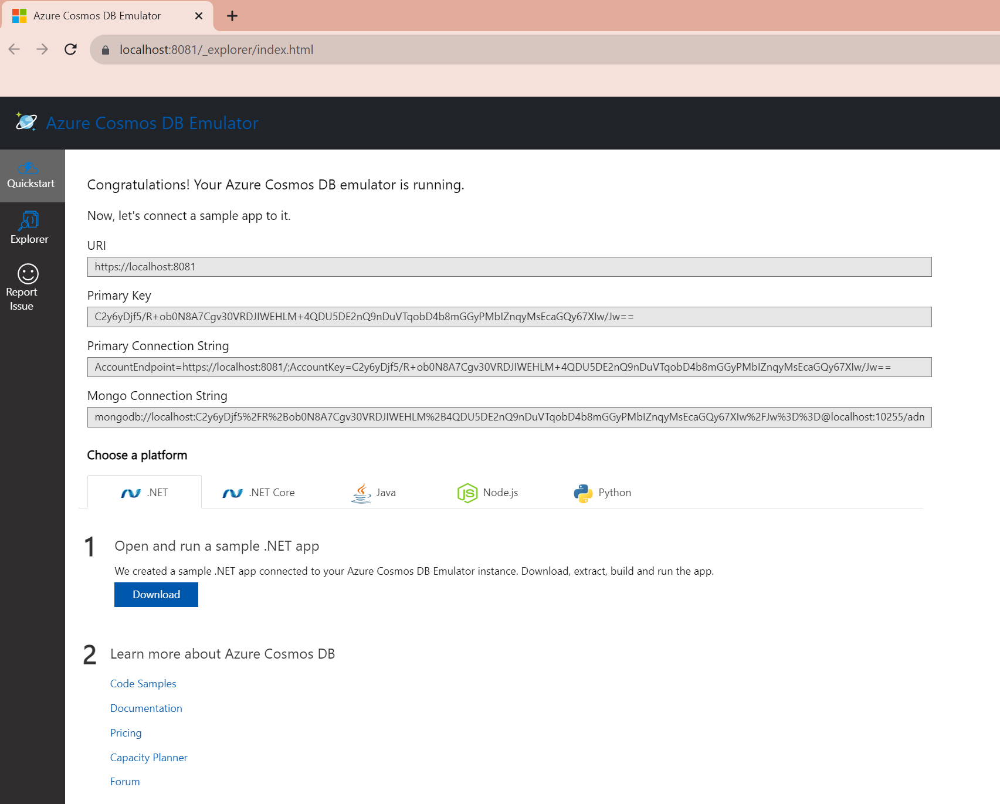

# ローカルでのCosmos DBの準備

## ローカルエミュレータ

Windowsにはローカルエミュレータを簡単にインストールできます。MicrosoftはCosmos DBエミュレータのdockerイメージを提供していますが、macOSやLinuxではSSL/TSLの設定が必要で、まだ試していません。macOSで使用する場合は、Azure Cosmos DBを使用します。

まず、WindowsにCosmos DB Emulatorをインストールします。

[Microsoft Learn Websiteからダウンロードする](https://learn.microsoft.com/en-us/azure/cosmos-db/emulator-release-notes)

インストール後、「Azure Cosmos DB Emulator」を起動できます。Cosmos DB Emulatorのバージョン`2.14.2`では、階層的パーティションキーを使用するために特殊なプレビューモードで起動する必要はありませんでした。

Azure Cosmos DB Emulatorを起動すると、Windowsタスクバーのアイコンからアクセスできます。Cosmos DBの惑星アイコンをクリックして「Data Explorerを開く」を選択します。

Data Explorerでクイックスタートを開き、次の情報をコピーします。

- **Connection String**

これらの情報はアプリケーションのテスト時に使用します。