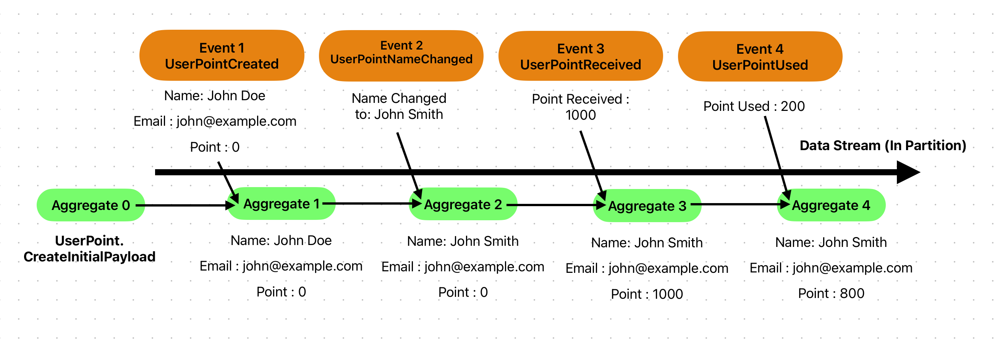
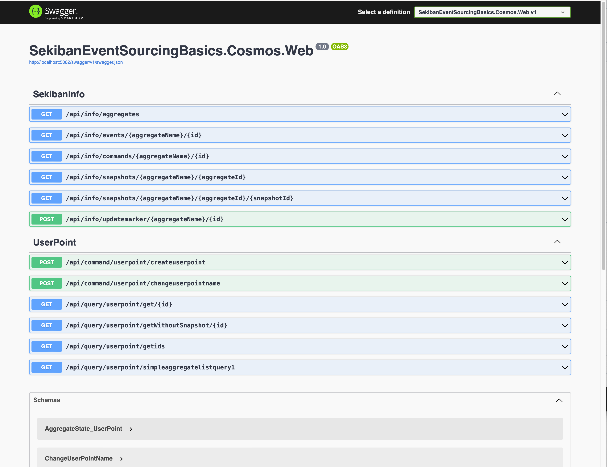

# Sekiban イベントソーシングの基礎

## イベントソーシングの基礎

イベントソーシングの基本的な概念は、真実の源は常にイベントにあり、状態はイベントストリームから算出できるということです。イベントは追記のみで、何がイベントとして起こったかを含むべきで、なぜそれが起こったのかを含むことが好ましいです。

## イベントの源 - ストリーム

イベントソーシングでは、最初に理解する必要がある概念はイベントのストリームです。イベントは「Partition」というものでグループ化され、一つの「Partition」は複数のイベントを持ち、状態を作ります。このグループ化を「Aggregate」と呼びます。Sekibanでは、「Aggregate」はタイプを持ち、イベントの集合を持ちます。「Aggregate」はそれぞれのイベントの後の状態を管理します。これは下の画像で説明されています。



この画像は、イベントストリームによってどのようにaggregateが変化するかを示しています。

1. Event1はJohn Doeというユーザーを作り、john@example.comと0ポイントを与えます。
2. Event2は名前をJohn Smithに変更します。アグリゲートの名前が変わりましたが、メールとポイントは前の状態から変わっていません。
3. Event3はポイントを1000加えます。アグリゲートの名前とメールはそのままで、ポイントが1000加えられ、現在のポイントは1000になります。
4. Event4はポイントを200使用します。アグリゲートの名前とメールはそのままで、ポイントは1000から200減るので、現在のポイントは800になります。

この画像と説明のように、あなたはアグリゲートとイベントを定義し、イベントがアグリゲートの状態を変えることができます。Sekibanでは、以下のようにAggregateとEventを定義することができます。

これはSekibanイベントソーシングの基礎チュートリアルからのもので、レポジトリの `/Samples/Tutorials/1.SekibanEventSourcingBasics` フォルダにあります。

```csharp
   public record UserPoint(string Name, string Email, int Point) : IAggregatePayload<UserPoint>
   {
    // Aggreagte 0
       public static UserPoint CreateInitialPayload(UserPoint? _) => new UserPoint(string.Empty,string.Empty,0);
   }

   public record UserPointCreated(string Name, string Email, int Point) : IEventPayload<UserPoint, UserPointCreated>
   {
    // Aggregate 1 = f(aggregate0, event1)
       public static UserPoint OnEvent(UserPoint aggregatePayload, Event<UserPointCreated> ev) =>
           new(ev.Payload.Name, ev.Payload.Email, ev.Payload.Point);
   }

   public record UserPointNameChanged(string ChangedName) : IEventPayload<UserPoint, UserPointNameChanged>
   {
    // Aggregate 2 = f(aggregate1, event2)
       public static UserPoint OnEvent(UserPoint aggregatePayload, Event<UserPointNameChanged> ev) =>
           aggregatePayload with { Name = ev.Payload.ChangedName };
   }

   public record UserPointReceived(int Point, string Note) : IEventPayload<UserPoint, UserPointReceived>
   {
    // Aggregate 3 = f(aggregate2, event3)
       public static UserPoint OnEvent(UserPoint aggregatePayload, Event<UserPointReceived> ev) =>
           aggregatePayload with { Point = aggregatePayload.Point + ev.Payload.Point };
   }

   public record UserPointUsed(int Point, string Note) : IEventPayload<UserPoint, UserPointUsed>
   {
    // Aggregate 4 = f(aggregate3, event4)
       public static UserPoint OnEvent(UserPoint aggregatePayload, Event<UserPointUsed> ev) =>
           aggregatePayload with { Point = aggregatePayload.Point - ev.Payload.Point };
   }

```

上記のコードはシンプルですが、イベントソーシングストリームを定義する方法を示しています。

このケースでは、集約（ストリーム）は UserPoint と名付けられています。この UserPoint ストリームは、ポイントを持つ1人のユーザーを管理します。もし2人のユーザーが存在する場合、それは2つの異なるストリームを使用する必要があります。

上記のコードから、このコードがAggregatePayloadとEventPayloadを表現していることがわかります。集約とイベントの共通情報、つまりAggregateId、TimeStamp、SortKey、PartitionKeyなどは集約とイベントにあり、開発者はPayloadの中身についてコードを書くことになります。

重要な制限の一つは、イベントは例外をスローすることはできません。それはシステムが稼働している間ずっと使われるでしょう、集約状態を構築する方法として。もし間違ったイベントが間違った時間に送られたら、集約を変更せずにリターンすることができます。

### イベントソーシングを書く“関数型的”な方法。

上記のコードはSekibanで実行できる実際のコードで、他のイベントソーシングライブラリーやサンプルコードで見るものとは若干異なる可能性があります。Sekibanはイベントソーシングを“関数型的”な方法として取り組み、C#の関数型的な機能を最大限使用しようと試みました。IAggregatePayloadインターフェースのメソッド"CreateInitialPayload"とIEventPayload "OnEvent"メソッドは静的で純粋な関数であり、インスタンスを変更するのではなく、新しいインスタンスを作成して新しいオブジェクトとして返します。これにより、並行実行に対する互換性が向上し、コードベースを見やすくなります。

## イベントを生成する唯一の方法 - コマンド

イベントとイベントで作成された状態はSekibanの最も基本的な部分です。しかし、`コマンド`もイベントソーシングの大きな部分を占めています。Sekibanおよび一般的なイベントソーシングでは、`コマンド`がイベントを作成するものです。

コマンドには以下の機能が含まれるべきです。

- イベントが書き込まれるストリームを決定する (AggregateId)。
- データのバリデーション
- 一貫性のチェック
- イベントの生成

また、`コマンド`には主に2つの部分があります。

1. コマンドデータ (通常は`コマンド`と呼ばれます) - 注文内容で、通常はユーザーから送られてきます。場合によっては、システムがアグリゲート（ストリーム）に対してコマンドを送ることもあります。

    コマンドは、`GetAggregateId();`でGuid Valueを返すことにより、イベントが書き込まれるストリームを決定する必要があります。
    Sekibanでは、検証属性が制約を定義できる検証のほとんどを担当します。

2. コマンドハンドラ - 注文 (コマンド) を処理し、保存するためのイベントを作成する機能またはプログラム。

これは、CreateUserPointおよびChangeUserPointNameのサンプルコマンドです。

```csharp
public record CreateUserPoint(
    [property: Required]string Name, 
    [property:Required, EmailAddress]string Email,
    [property:Range(0,10000)] int Point) : ICommand<UserPoint>
{
    public Guid GetAggregateId() => Guid.NewGuid();

    public class Handler : ICommandHandler<UserPoint, CreateUserPoint>
    {
        public IEnumerable<IEventPayloadApplicableTo<UserPoint>> HandleCommand(CreateUserPoint command, ICommandContext<UserPoint> context)
        {

            // can check if email is already registered in the system

            yield return new UserPointCreated(command.Name, command.Email, command.Point);
        }
    }
}
```

``` csharp
public record ChangeUserPointName(
    [property: Required] Guid UserPointId,
    [property: Required] string NameToChange) : ICommand<UserPoint>
{
    // Aggregate Id should be current aggregate.
    public Guid GetAggregateId() => UserPointId;

    public class Handler : ICommandHandler<UserPoint, ChangeUserPointName>
    {
        public IEnumerable<IEventPayloadApplicableTo<UserPoint>> HandleCommand(ChangeUserPointName command, ICommandContext<UserPoint> context)
        {
            // consistency check.
            if (command.NameToChange == context.GetState().Payload.Name)
                throw new InvalidOperationException("Already have same name as requested.");
            
            yield return new UserPointNameChanged(command.NameToChange);
        }
    }
}
```


上記のコードには2つの主要なクラスがあります。

- CreateUserPoint,CreateUserPoint : コマンドデータクラス。
    Sekibanでは、コマンドはストリームが保存するべき`Aggregate Id`を決定する責任があります。ストリームは`AggregateId`と`Aggregate Type`でパーティションされます。（実際にはもう1つキー`RootPartitionKey`がありますが、これは別のドキュメントで説明します。）コマンドはすでに`Aggregate Type`を持っているので、`Aggregate Id`を決定する必要があります。これは、`GetAggregateId()`でGuid値を返すことで行うことができます。新しいストリームを作成したい場合は、`Guid.NewGuid()`を返してユニークなGuidを作成できます。これが、CreateUserPointコマンドが`GetAggregateId() => Guid.NewGuid()`.を返す理由です。一方、CreateUserPointコマンドを実行するためには、すでに存在するAggregate Idを参照する必要があるため、`CreateUserPoint`には、`GetAggregateId()`で使用されるプロパティ`UserPointId`があります。
    バリデーションはCommandのもう一つの重要な役割です。このサンプルでは、コマンドは`[property : Required]`や`[property : EmailAddress]`を持っています。これらのバリデーション属性は、コマンドハンドラーの前に実行されます。これにより、システムに誤ったデータが追加されることを防ぐことができます。その他の複雑なバリデーションは、Handlerメソッド内で行うこともできます。
- `CreateUserPoint.Handler`, `CreateUserPoint.Handler` : コマンドハンドラークラス。
    コマンドハンドラは、コマンドがこのコマンドを実行できるかどうかをチェックできます。誤ったコマンドが送信された場合にコマンドが例外をスローする問題はありません。（イベントは既に発生したものですが、コマンドは将来試すべきものなので、場合によっては失敗することがあります。）コマンドハンドラはdotnetからDIを持つことを許可し、Sekibanコマンドハンドラメソッドは同期/非同期であることができ、どちらを使用するかはコマンドごとに選択できます。そのため、ある時点でクエリを実行したり、コマンドを実行可能かどうかを判断したりすることができます。

    一貫性テストがパスしたとき、イベントを生成することができます。イベントはシステムがすでに許可したものなので、それは事実として扱われます。

### イベントとコマンドの命名

このドキュメントで議論したことにより、イベントとコマンドの命名は以下の通りです。

- **イベント** : 過去形の文、例えば UserCreated や NameChanged
- **コマンド** : 命令形の語、例えば CreateUser や ChangeName

## 依存の定義

Sekibanには依存の定義の設定があります。定義ファイルにどの集約体、コマンド、投影、およびクエリを追加するかを記述することで、同じ定義を使ってテストを行い、本番で実行することができます。

私たちが作成したこのプロジェクトでは、定義ファイルは以下のようになります。

```csharp
public class DomainDependency : DomainDependencyDefinitionBase
{
    public override Assembly GetExecutingAssembly() => Assembly.GetExecutingAssembly();

    public override void Define()
    {
        AddAggregate<UserPoint>()
            .AddCommandHandler<CreateUserPoint, CreateUserPoint.Handler>()
            .AddCommandHandler<ChangeUserPointName, ChangeUserPointName.Handler>();
    }
}
```

上記の定義ファイルは、テストまたは実稼働環境のどちらでも使用可能です。

## テストについて

Sekibanには、実際にCosmos DB / Dynamo DBにデータを実行して保存することなく、テストをサポートするフレームワークが備わっています。

テストプロジェクトを作るために新しいxUnitプロジェクトを作成する必要があります。あなたのドメインプロジェクトを参照してください。また、 Sekiban.Testing Nugetパッケージを追加します。
これらの準備が整った後、あなたのSekiban Aggregateをテスト開始するために必要なことは次のコードを実行するだけです。

`Sekiban.Testing` パッケージのメソッドは、GWTスタイルの命名を使用しており、Given When Thenスタイルで書くことができます。Arrange Act Assertメソッド名はありませんが、AAAスタイルでも使用することができます。また、イベントやアグリゲートを取得するヘルパーも持っているため、`FluentAssertion` やその他のC#テストヘルパーを使用して自分自身の方法でテストを書くことができます。

```csharp
public class UserPointSpec : AggregateTest<UserPoint, DomainDependency>
{
    [Fact]
    public void TestCreateUserPoint()
    {
        WhenCommand(new CreateUserPoint("John Doe", "john@example.com",0));
        ThenPayloadIs(new UserPoint("John Doe", "john@example.com", 0));
    }
}
```


AggregateTestを継承するときは、集約ペイロードクラスとして`UserPoint`と、あなたの依存関係定義クラスである`DomainDependency`を入力することができます。

それによって、以下のテストを書くことができます。

- CreateUserPoint コマンドが実行されたとき、
- 集約ペイロードは特定の値になります。

これは非常にシンプルなテストですが、複数のコマンドもテストすることができます。

```csharp
public class UserPointSpec : AggregateTest<UserPoint, DomainDependency>
{
   [Fact]
    public void TestChangeName()
    {
        GivenCommand(new CreateUserPoint("John Doe", "john@example.com",0));
        WhenCommand(new ChangeUserPointName(GetAggregateId(), "John Smith"));
        ThenPayloadIs(new UserPoint("John Smith", "john@example.com", 0));
    }
}

```

次のようにテストを記述することができます。

- Given CreateUserPoint コマンドが実行された場合
- When ChangeUserPointName コマンドが実行された場合
- Then Aggregate Payload は特定の値になり、名前はそれが記述されている通りに変わるべきです

また、コマンドの検証もテストできます。

```csharp
public class UserPointSpec : AggregateTest<UserPoint, DomainDependency>
{
    [Fact]
    public void TestCreateUserPointFailedValidation()
    {
        // Empty name
        WhenCommand(new CreateUserPoint("", "john@example.com",0));
        ThenHasValidationErrors();
    }
    [Fact]
    public void TestCreateUserPointFailedValidation2()
    {
        // Wrong email address
        WhenCommand(new CreateUserPoint("John Doe", "john_example.com",0));
        ThenHasValidationErrors();
    }
}
```

次のテストは、誤った名前やメールアドレスを指定し、それに対してセキバンが検証エラーをスローする必要があります。 `ThenHasValidationErrors`を使用すると、セキバンのテストフレームワークはこれらをチェックできます。

これらのテストサンプルは、`Sekiban.Testing` パッケージが提供する多くの機能の一部に過ぎません。`Sekiban.Testing`パッケージは、コマンド、イベント、そしてアグリゲートが意図した通りに機能するかを開発者が確認するのを助けます。

## Web API

開発者が集約やコマンド、イベントをビルドし、それがテストされた後、非常に簡単な追加でAPIを作成することができます。`Program.cs`には少数の準備と追加が必要です。

`Sekiban.Web` のNugetパッケージはドメインオブジェクトからのAPI生成を提供しますが、オプションのパッケージです。開発者は自分のコントローラーやユースケースからSekibanのコマンドを呼び出し、自分のAPIを作成できます。通常、イベントソーシングコマンドはユースケースなので、`Sekiban.Web`を使用してコマンド自体を自動生成するのが良いでしょう。

1. Webプロジェクトを作る。
   Web API (Controller)を持つ新しいWebプロジェクトを作り、`Domain Project`を参照します。そして、Webプロジェクトを追加し、`Sekiban.Web`のNugetパッケージとInfrastructureパッケージを追加できます。Cosmos DBかDynamo DBを選び、以上のNugetパッケージである`Sekiban.Infrastructure.Cosmos`か`Sekiban.Infrastructure.Dynamo`を追加できます。
2. Web依存定義を作る
    Web依存定義はそのプロジェクト内のWeb APIの設定であり、特定のWebでどのコマンドや集約、クエリが使用できるかに制限を設けたい場合、このファイルで設定を行うことができます。初めての場合、全ての集約、コマンド、クエリがWebプロジェクトで使用できるように以下のように書くことができます。

```csharp
public class SekibanWebDependency : DomainDependency, IWebDependencyDefinition
{
    public bool ShouldMakeSimpleAggregateListQueries => true;
    public bool ShouldMakeSimpleSingleProjectionListQueries => true;
    public AuthorizeDefinitionCollection AuthorizationDefinitions => new();
    public SekibanControllerOptions Options => new();
}
```

3. Program.csを編集しましょう

    Program.csの変更は非常に簡単です。以下に、CosmosDBプロジェクトのための全ての`Program.cs`を示します。（使用する前に必要です。）

```csharp
var builder = WebApplication.CreateBuilder(args);

// Sekiban Core Setting
builder.AddSekibanWithDependency(new DomainDependency());
// Sekiban Cosmos Setting
builder.AddSekibanCosmosDB();
// Change line above to Dynamo DB if you use Dynamo DB
//builder.AddSekibanDynamoDB();

// Sekiban Web Setting
builder.Services.AddSekibanWeb(new SekibanWebDependency());

// Learn more about configuring Swagger/OpenAPI at https://aka.ms/aspnetcore/swashbuckle
builder.Services.AddEndpointsApiExplorer();
// Add Sekiban CustomSchemaIds etc.
builder.Services.AddSwaggerGen(options => options.AddSekibanSwaggerGen());

var app = builder.Build();

// Configure the HTTP request pipeline.
if (app.Environment.IsDevelopment())
{
    app.UseSwagger();
    app.UseSwaggerUI();
}

app.UseHttpsRedirection();

app.UseAuthorization();

// need this to use Sekiban.Web
app.MapControllers();

app.Run();
```

4. appsettings.json の編集

以下はCosmos DB使用のための appsettings.jsonの設定です。

```json

{
  "Logging": {
    "LogLevel": {
      "Default": "Information",
      "Microsoft.AspNetCore": "Warning"
    }
  },
  "ConnectionStrings" : {
    "SekibanCosmos": "[Set your cosmosDB connection string here.]",
    "SekibanBlob": "[Set your blob connection string here. (not necessary for just running the sample)]",
  }
}

```
自身のCosmos DBへの接続情報を記入することができます。

Dynamo DBの設定は以下の通りです。

```json
{
  "Logging": {
    "LogLevel": {
      "Default": "Information",
      "Microsoft.AspNetCore": "Warning"
    }
  },
  "Sekiban": {
    "Default": {
      "Aws" : {
        "DynamoRegion": "ap-northeast-1",
        "AccessKeyId": "[Set your dynamo db access id here]",
        "AccessKey": "[Set your dynamo db access key here]",
        "DynamoItemsTable": "jjlt_items",
        "DynamoEventsTable": "jjlt_events",
        "DynamoItemsTableDissolvable": "jjlt_d_items",
        "DynamoEventsTableDissolvable": "jjlt_d_events",
        "S3BucketName": "jjlt-s3",
        "S3Region": "us-west-1",
      }
    }
  },
  "AllowedHosts": "*"
}
```

設定後、プロジェクトの実行により、Swaggerのページが表示されます。



## 結論
この文書では、Sekibanの基本的な使い方について説明しました。

- 集約
- イベント
- コマンド
- 依存関係の定義
- テスト
- Web API

ここで説明したのは機能の一部に過ぎません。他の文書では、より詳細な機能が説明されます。

[詳細な機能のインデックス](./sekiban-details.md).