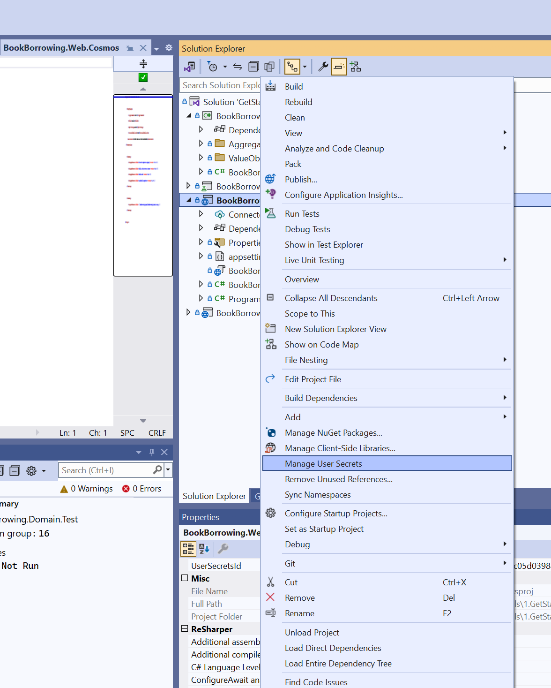
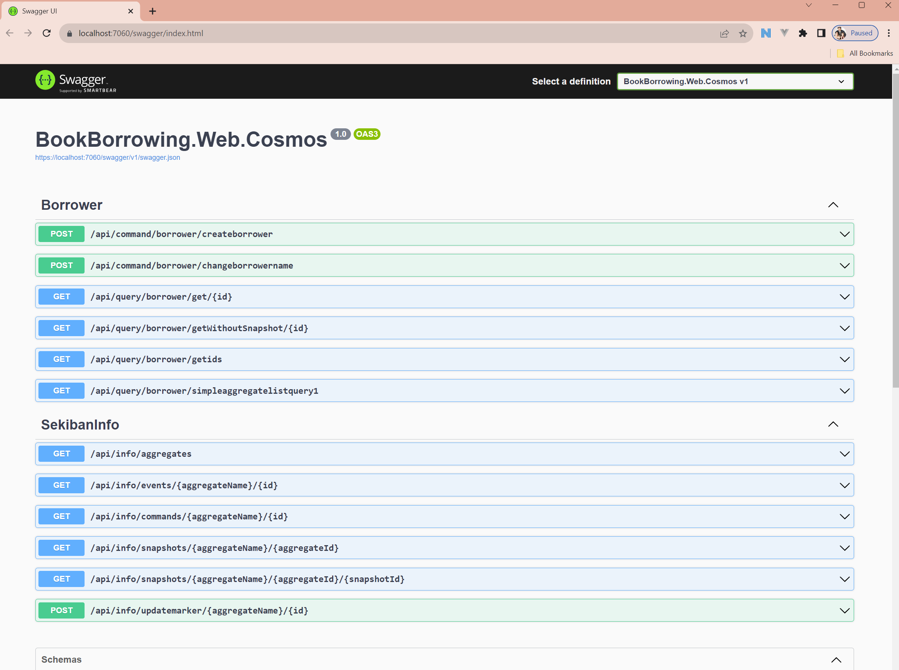
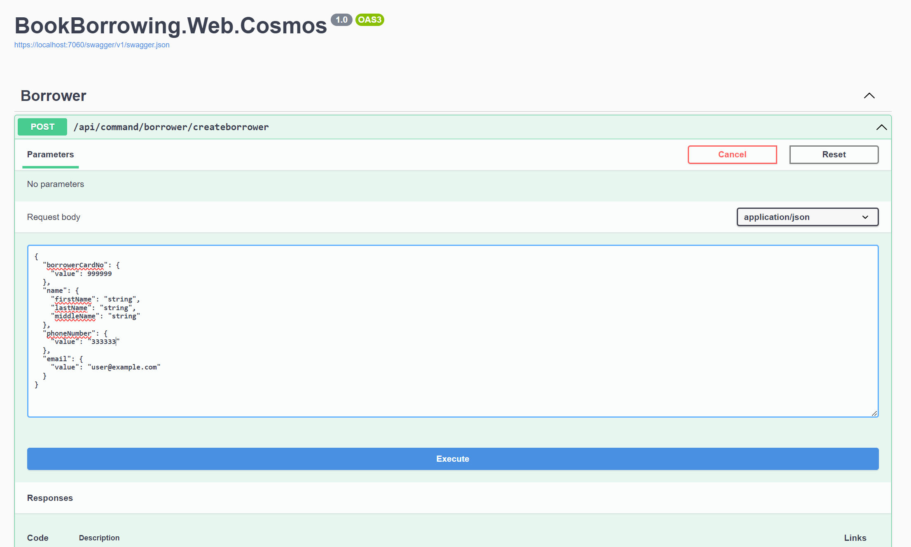
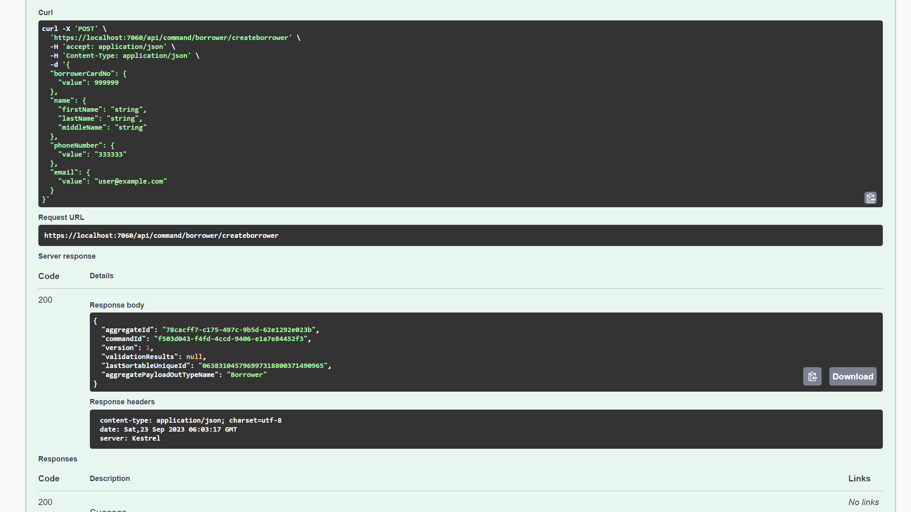
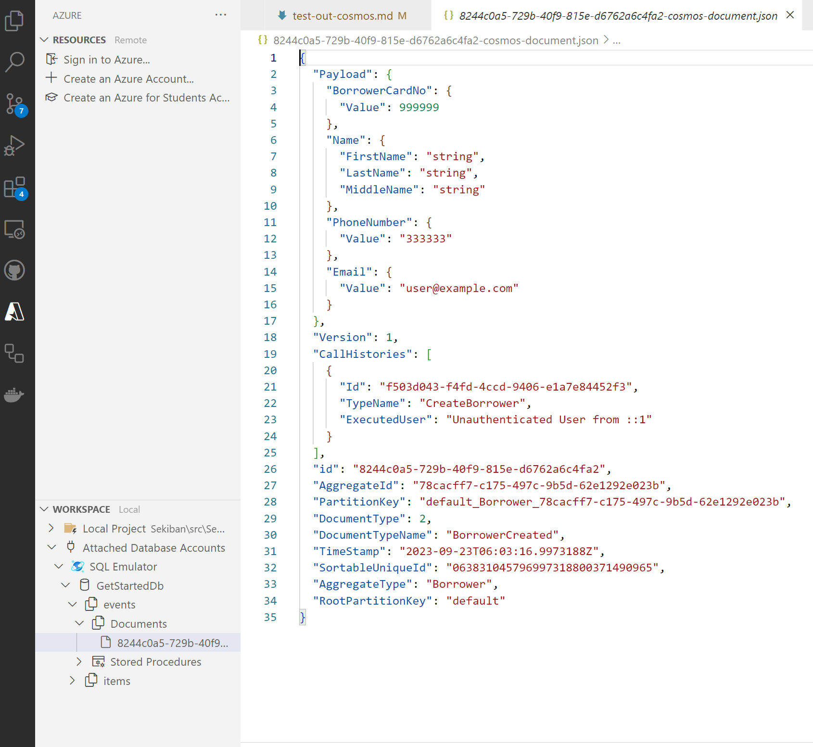

# Cosmos DBを使用してGetStarted Solutionをテストする

GetStartedソリューションをテストするには、Cosmos DBが必要です。

## Cosmos DBの準備

ローカルエミュレータを使用するか、Azure Cosmos DBを使用することができます。Sekibanでは新たに [階層型パーティションキー](https://learn.microsoft.com/en-us/azure/cosmos-db/hierarchical-partition-keys?tabs=net-v3%2Cbicep) 機能をCosmos DBで使用しているため、開発者はこれを正確に使用する方法を理解している必要があります。

どちらを使用する場合も、以下の情報を取得する必要があります。

- **CosmosDB Connection String**

Windowsのローカルエミュレーターについては、[このページ](./prepare-cosmos-db-local.md)をご覧ください。

Azure Cosmos DBについては、[このページ](./prepare-cosmos-db-azure.md)をご覧ください。
Cosmos DBを準備する際には、***URI*** と ***Primary Key*** を手元に控えておくことを忘れないでください。

## Blobストレージの準備（オプション）
Sekibanは以下のデータ用にblobストレージを使用します。

- サイズが大きい場合の集計スナップショット。
    Azure Cosmos DBには4MBのデータ制限がありますが、限度に達しないように、ペイロードjsonが約1MBに達しそうになった時点で、sekibanはスナップショットblobを作成します。
- プロジェクションスナップショット。
    プロジェクションスナップショットは常にblobストレージに作成されますが、デフォルト設定では3000イベント以下のスナップショットは作成されません。

データの取得開始レベルではblobを使用するケースはまれなため、取得開始プロジェクト用にblobストレージを作成する必要はありません。

ソリューションを実行する方法はいくつかあります。

1. Visual Studio 2022
2. コマンドライン（dotnetコマンド） - Visual Studio Codeや他のエディタ。
3. JetBrains Rider.

これらのアプリケーションすべてでSekibanを開発することができますが、まずはVisual Studio 2022を使用して説明します。

### Visual Studio 2022を使用してソリューションを開き、URIとプライマリキーを設定する

Visual Studio 2022をインストールします。バージョンは17.7（dotnet 7互換）か、それより新しいものである必要があります。

1. /Tutorials/1.GetStarted/GetStarted.slnを開きます
2. BookBorrowing.Web.Cosmosプロジェクトを右クリックし、`Manage User Secrets`を選択します

3. User Secretsを編集し、以下の情報を記入します。


```json
{
  "ConnectionStrings" : {
    "SekibanCosmos" :"[Set your cosmosDB connection string here.]",
    "SekibanBlob" : "[Set your blob connection string here. (not necessary for just running the sample)]"
  }
}
```


URIとプライマリキーが正しく設定されていれば、Sekiban Web APIを実行することができます。

### Visual Studio 2022を使用してWebプロジェクトとコマンドを実行します。

1. BookBorrowing.Web.Cosmos をスタートアッププロジェクトとして設定し、プロジェクトをデバック実行します。

もしプログラムが正常に動作した場合、次のようなウェブサイトが表示されます。



2. createborrower コマンドを実行します。

createborrower コマンドをクリックし、 Try Out ボタンを押します。

phonenumber.valueを6桁以上の数値に変更し、`Execute`コマンドを実行します。



もしコマンドが200（成功）のメッセージを返す場合、コマンドの実行に成功したことになります！



結果から集約IDをコピーできます。

これはGuidの値で、新規の集約を作成する時には常に異なるIDが付けられるはずですが、同じ集約IDを通じて共有されます。このケースでは、集約IDは `78cacff7-c175-497c-9b5d-62e1292e023b` でした。

### Cosmos DBに保存されたデータの確認。

#### ローカルエミュレータ

Cosmos DBエミュレータ 2.14.2 では、階層的なパーティションキーデータを石版から作成することができますが、Data Explorerは保存されたjsonデータを表示することができません。まだ旧版のフロントエンドを使用していると考えられます。

データを表示するには、`Azure Databases Extension for VS Code` を使用できます。

詳しい情報は、[Cosmos DBのウェブサイト](https://developer.azurecosmosdb.com/tools)から取得できます。

Visual Studio Codeにインストールした後に、左側のバーから"A"アイコンをクリックしてAzure Databases Extensionを開きます。"Workspace"エリアには Attached Database Accounts - Attach Emulator ボタンがあります。`Core (SQL)` を選択してローカルエミュレータに接続できます。

GetStartedDb - Events - Documentsを選択し、最初のコマンドで作成した1つのデータがある場合、成功です。

注：おそらくこの拡張機能にもまだ多くのバグがあると思われます。`SQL Emulator` を右クリックして`Detach`を選択してエミュレータをDetachし、再度Attachしなければデータを更新することができませんでした。



#### Azure Cosmos DB.

Azure Cosmos DBでは、DataExplorerに移動して GetStartedDb - Events - Items を探し、最初のコマンドで作成したデータを見つけることができます。JSONは、ローカルエミュレータで見ることができるものと同じであるべきです。
### Sekibanからのクエリ。
Sekiban Webにもクエリ機能があります。Sekiban Webから1つの集約またはリスト集約を取得することができます。

#### 集約リストを表示する

再度 BookBorrowing.Web.CosmosDB を実行し、`/api/query/borrower/simpleaggregatelistquery1` を選択してから Try Out - Execute を選択します。 入力値を変更する必要はありません。

この時点の集計リスト（この時点では1つの集計のみ）を表示できます。

#### 一つの集約(Aggregate)の内容を表示する

`/api/query/borrower/get/{id}` を見つけて試してみてください。

実行結果から集計idを取得し、`id`に入力してください。集計値を取得できるはずです。

これがGetStarted Projectを試す方法です。

このドキュメントでは、コマンド、イベント、および集計の詳細についてはあまり説明していませんが、セキバンがどのようにデータを作成し保存することができるかにつての概念を掴むことができるでしょう。

`BookBorrowing.Domain` プロジェクトを確認して、以下の項目を見つけることができます。
-  コマンド `BookBorrowing.Domain/Aggregates/Commands/CreateBorrower.cs`
- イベント `BookBorrowing.Domain/Aggregates/Events/BorrowerCreated.cs`
- 集計 `BookBorrowing.Domain/Aggregates/Borrower.cs`

#### 借り手の名前を変更する。

次に、借り手の名前を変更してみましょう。同じ集約IDでコマンドを実行すると、新たなイベントを保存することで集約情報を編集することができます。

1. BookBorrowing.Web.Cosmosプロジェクトを再度実行します。
2. /api/command/borrower/changeborrowernameコマンドを探します。
3. 情報を入力して試してみてください。

Aggregate Idを`borrowerId`に入力します。

新しい名前を`changename.firstname`,lastname,middlenameに入力します。

ただし、`middlename`のみ空欄にすることができます。

```
{
  "borrowerId": "78cacff7-c175-497c-9b5d-62e1292e023b",
  "changedName": {
    "firstName": "John",
    "lastName": "Doe",
    "middleName": ""
  },
  "reason": "Typo"
}
```

もしあなたが正常に実行したら、その結果を確認することができます。

集計リストを作成するか、再度1つの集計を取得することができます。

このケースでは、1つの集計を取得すると、結果は以下のような json 形式になるはずです。

```
{
  "payloadTypeName": "Borrower",
  "payload": {
    "borrowerCardNo": {
      "value": 999999
    },
    "name": {
      "firstName": "John",
      "lastName": "Doe",
      "middleName": ""
    },
    "phoneNumber": {
      "value": "333333"
    },
    "email": {
      "value": "user@example.com"
    },
    "borrowerStatus": 1
  },
  "aggregateId": "78cacff7-c175-497c-9b5d-62e1292e023b",
  "version": 2,
  "rootPartitionKey": "default",
  "lastEventId": "d751a968-4ece-4f02-8b7c-a5fdf65da7a6",
  "appliedSnapshotVersion": 1,
  "lastSortableUniqueId": "063831048949238474201018050853"
}
```

名前が変更されたことがわかるでしょう。

また、Cosmos DBのイベントを確認すると、今度は2つのイベントが表示されます。

イベントソーシングでは、アグリゲートを編集する場合でも、イベントは削除されません。イベントは追加され、システムが2つのイベントを確認すると、現在のアグリゲート状態を計算できます。