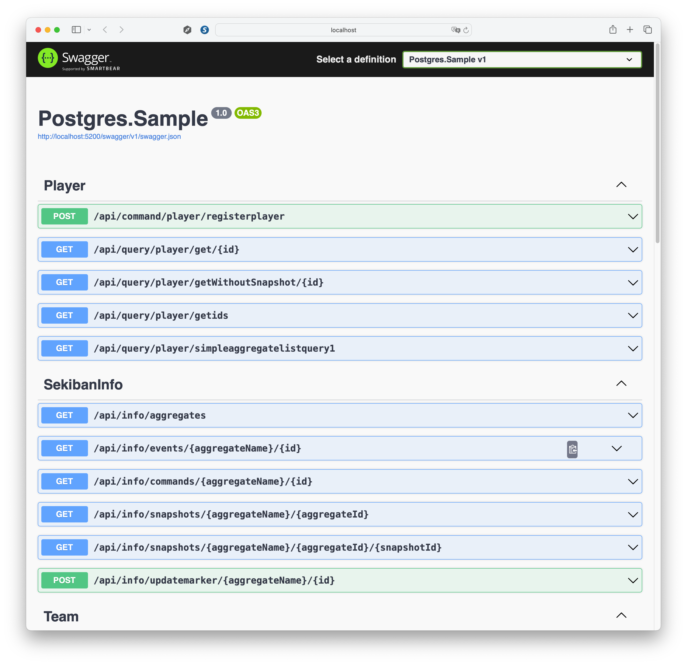
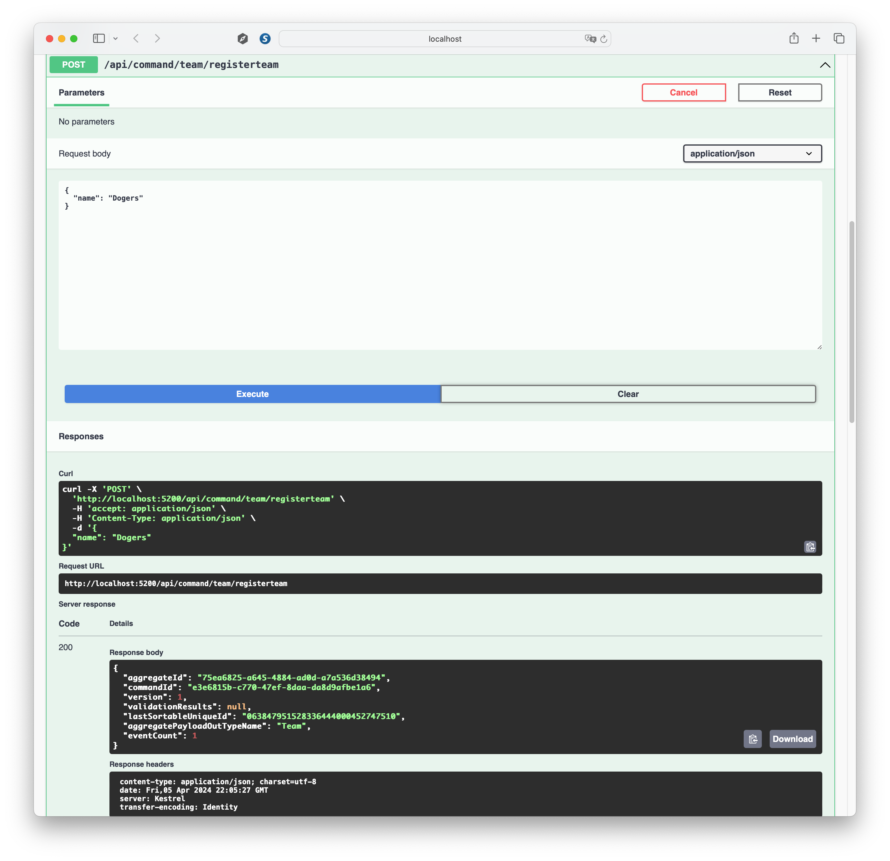
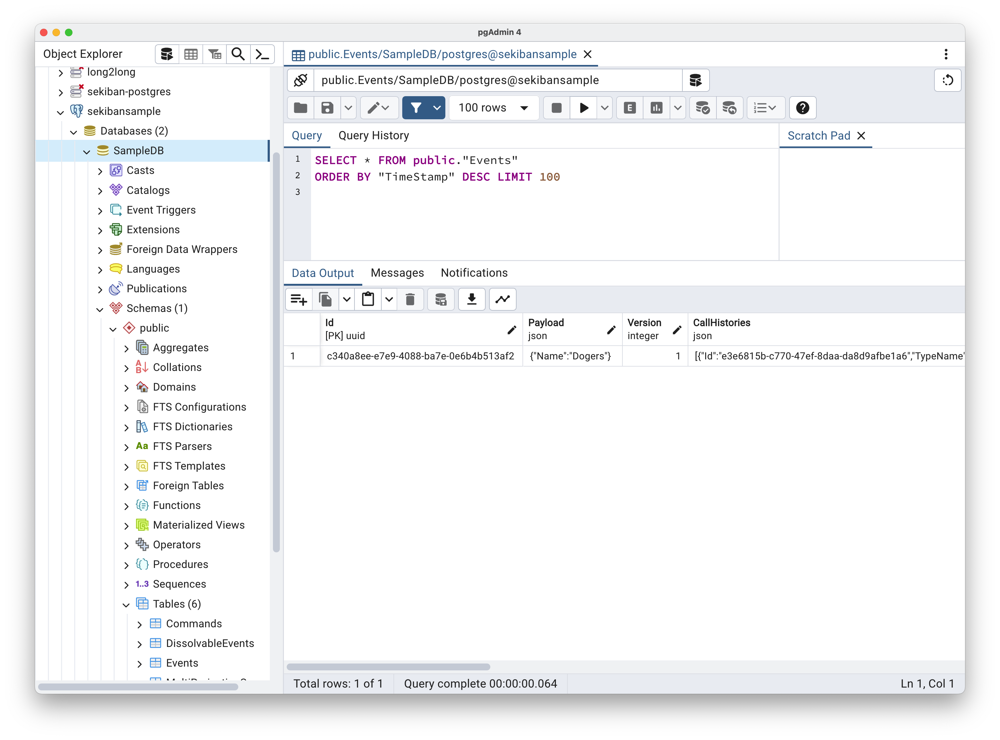
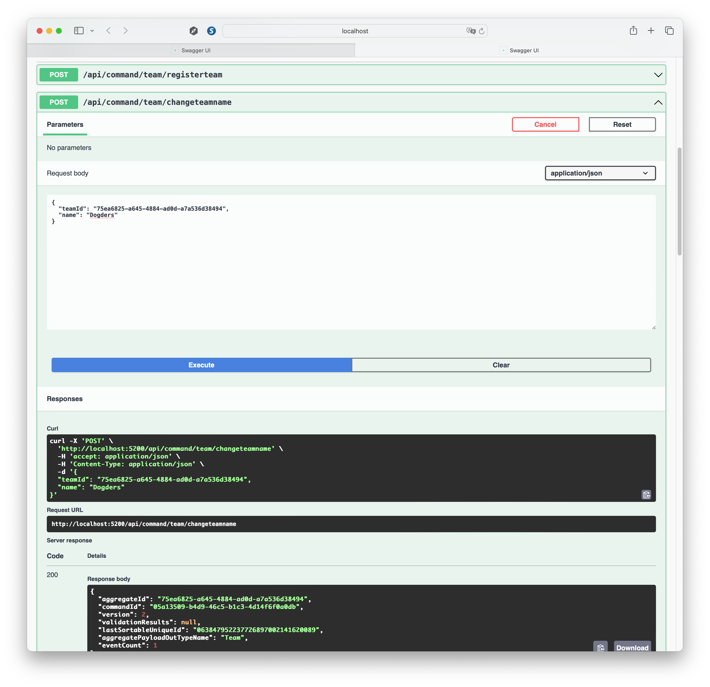

# PostgreSQLを使用して開発を行う

`/Samples/Tutorial/3.PostgresSample` にPostgresを使用したサンプルプロジェクト、およびDockerでPostgresを起動することのできる `docker-compose.yml`を用意しています。

## PostgreSQLの準備

1. Dockerを実行できる環境を用意します。
2. `/Samples/Tutorials/3.PostgresSample/DockerCompose` をTerminalで開きます。
3. `Samples/Tutorials/3.PostgresSample/DockerCompose/docker-compose.yml` の18行目で必要に応じてパスワードや22行目のポートを変更します。
4. `docker compose up -d`でPostgresを起動します。
5. [PgAdmin](https://www.pgadmin.org/download/) などのPostgresツールでデータベースが作成されていることを確認します。（この際、データベースSampleDb -> Schemas -> Tables の中にはテーブルができている必要はありません。）

## Blobストレージの準備（オプション）

Sekibanは以下のデータ用にblobストレージを使用します。

- サイズが大きい場合の集計スナップショット。
    Azure Cosmos DBには4MBのデータ制限がありますが、限度に達しないように、ペイロードjsonが約1MBに達しそうになった時点で、sekibanはスナップショットblobを作成します。
- プロジェクションスナップショット。
    プロジェクションスナップショットは常にblobストレージに作成されますが、デフォルト設定では3000イベント以下のスナップショットは作成されません。

データの取得開始レベルではblobを使用するケースはまれなため、取得開始プロジェクト用にblobストレージを作成する必要はありません。
作成する場合は、
- Azurite (ローカル実行) 
  - [インストール](https://learn.microsoft.com/en-us/azure/storage/common/storage-use-azurite?tabs=visual-studio%2Cblob-storage#install-azurite)
  - Dockerから、もしくはnpmから実行する
  - BlobのConnectionStringを取得

します。

## サンプルプロジェクトの実行

ソリューションを実行する方法はいくつかあります。

1. Visual Studio 2022
2. コマンドライン（dotnetコマンド） - Visual Studio Codeや他のエディタ。
3. JetBrains Rider.

これらのアプリケーションすべてでSekibanを開発することができますが、まずはVisual Studio 2022を使用して説明します。


### Visual Studio 2022を使用してソリューションを開き、URIとプライマリキーを設定する

Visual Studio 2022をインストールします。バージョンは17.8（dotnet 8互換）か、それより新しいものである必要があります。

1.  `Samples/Tutorials/3.PostgresSample/Postgres.Sample/Postgres.Sample.sln`を開きます
2. `Samples/Tutorials/3.PostgresSample/Postgres.Sample/Postgres.Sample/appsettings.Development.json`ファイルを開き、接続情報を確認します。

```json

  "ConnectionStrings": {
    "SekibanPostgres": "Host=localhost;Port=15432;Database=SampleDB;Username=postgres;Password=Change_Me_For_Security",
    "SekibanBlob": "UseDevelopmentStorage=true"
  }

```
上記の部分を作成したPostgres, Blob(作成しなくてもよい)の情報を設定します。

### Visual Studio 2022を使用してWebプロジェクトとコマンドを実行します。

1. Postgres.Sample をスタートアッププロジェクトとして設定し、プロジェクトをデバック実行します。

もしプログラムが正常に動作した場合、次のようなウェブサイトが表示されます。



1. registerteam コマンドを実行します。

registerteam コマンドをクリックし、 Try Out ボタンを押します。

チーム名を入れて、`Execute`コマンドを実行します。



もしコマンドが200（成功）のメッセージを返す場合、コマンドの実行に成功したことになります！

結果から集約IDをコピーできます。

これはGuidの値で、新規の集約を作成する時には常に異なるIDが付けられるはずですが、同じ集約IDを通じて共有されます。このケースでは、集約IDは `75ea6825-a645-4884-ad0d-a7a536d38494` でした。

### Postgres DBに保存されたデータの確認。

PgAdmin4などのデータベースツールを使い、該当のデータベースの内容を確認します。

SampleDb -> Schema -> Public -> Tables -> Events (View/Select Data)



イベントが保存されていれば成功です。

### Sekibanからのクエリ
Sekiban Webにもクエリ機能があります。Sekiban Webから1つの集約またはリスト集約を取得することができます。

#### 集約リストを表示する

再度 BookBorrowing.Web.CosmosDB を実行し、`/api/query/team/simpleaggregatelistquery1` を選択してから Try Out - Execute を選択します。 入力値を変更する必要はありません。

この時点の集計リスト（この時点では1つの集計のみ）を表示できます。

#### 一つの集約(Aggregate)の内容を表示する

`/api/query/team/get/{id}` を見つけて試してみてください。

実行結果から集計idを取得し、`id`に入力してください。集計値を取得できるはずです。

これがGetStarted Projectを試す方法です。

このドキュメントでは、コマンド、イベント、および集計の詳細についてはあまり説明していませんがSekibanがどのようにデータを作成し保存することができるかにつての概念を掴むことができるでしょう。

`Postgres.Sample.Domain` プロジェクトを確認して、以下の項目を見つけることができます。
-  コマンド `Postgres.Sample.Domain/Aggregates/Teams/RegisterTeam.cs`
- イベント `Postgres.Sample.Domain/Aggregates/Teams/TeamRegistered.cs`
- 集計 `Postgres.Sample.Domain/Aggregates/Teams/Team.cs`

#### チームの名前を変更する。

次に、チームの名前を変更してみましょう。同じ集約IDでコマンドを実行すると、新たなイベントを保存することで集約情報を編集することができます。

1. Postgres.Sample.Domainプロジェクトを再度実行します。
2. /api/command/team/changeteamname コマンドを探します。
3. 情報を入力して試してみてください。

Aggregate Idを`teamId`に入力します。

新しい名前を`name`に入力します。



もし正常に実行できたら、その結果を確認することができます。Versionが2になっているのがわかると思います。

集計リストを作成するか、再度1つの集計を取得することができます。

このケースでは、1つの集計を取得すると、結果は以下のような json 形式になるはずです。

```json
{
  "payloadTypeName": "Team",
  "payload": {
    "name": "Dogders"
  },
  "isNew": false,
  "aggregateId": "75ea6825-a645-4884-ad0d-a7a536d38494",
  "version": 2,
  "rootPartitionKey": "default",
  "lastEventId": "a08e3457-1b47-4327-8a9f-6dd9e3376245",
  "appliedSnapshotVersion": 1,
  "lastSortableUniqueId": "063847952237726897002141620089"
}```

名前が変更されたことがわかるでしょう。

また、Postgresのイベントを確認すると、今度は2つのイベントが表示されます。

イベントソーシングでは、アグリゲートを編集する場合でも、イベントは削除されません。イベントは追加され、システムが2つのイベントを確認すると、現在のアグリゲート状態を計算できます。
