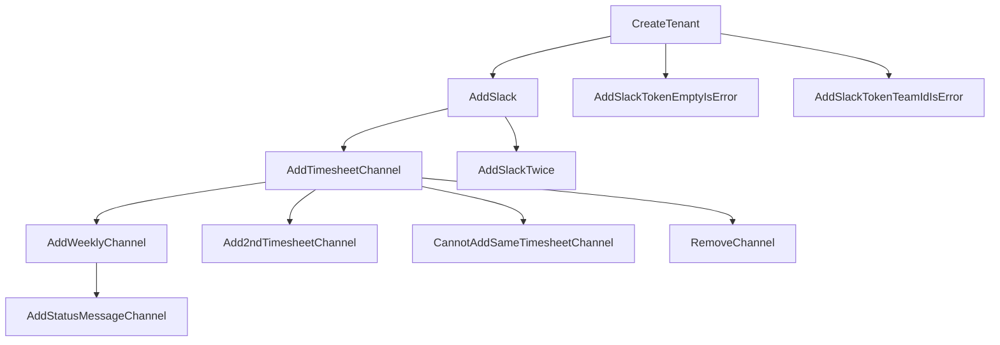

# 分岐型テストのイメージ




# テストは分離しているのか

集約に対する振る舞いを定義およびテストしている、BDD的テストを記述している
例えば、下のタイムシートチャンネル追加テストを実行するには、Slackの追加が成功している必要があるが、そのGivenを一から書くと手間がかかるため、Slack追加の正常系のテストの成功を前提条件(Given)としている。

以下の例で考えます。
```c#
    [Fact]
    public void AddTimesheetChannel()
    {
        GivenTestResult(AddSlack)
            .WhenChange(
                tenant => new AddSlackTenantChannelIntegration(
                    tenantId,
                    IntegrateChannelType.Timesheet,
                    timesheetChannelId)
                {
                    ReferenceVersion = tenant.Version
                })
            .ThenNotThrowsAnException() 
            .ThenState(
                tenant => new TenantDto(
                    tenant,
                    tenantName,
                    new TenantSlackIntegration(teamId, slackToken)
                    {
                        TimesheetListenChannels = new List<string>
                            { timesheetChannelId }
                    }));
    }
```

**タイムシートチャンネル追加 AddTimesheetChannel** のテストは
- AddSlack(Slack追加)の成功を前提(Given)としている
  - AddSlackはCreateTenant(テナント作成)の正常系の成功を前提(Given)としている
- その上で、When でタイムシートチャンネル追加コマンドを実行した**時 When**に
- **Then その時**、エラーが発生しないこと
- **Then その時**、ステータスが希望のものになっていることのチェック

このようなフローとなります。確かに、前のテストの結果を読んでいるのですが、テストとしては分離していますし、前提条件のテストで失敗したらエラーの位置は問題なくチェック可能ですので、前提が失敗したため、そちらを修正するべきということはわかります。


