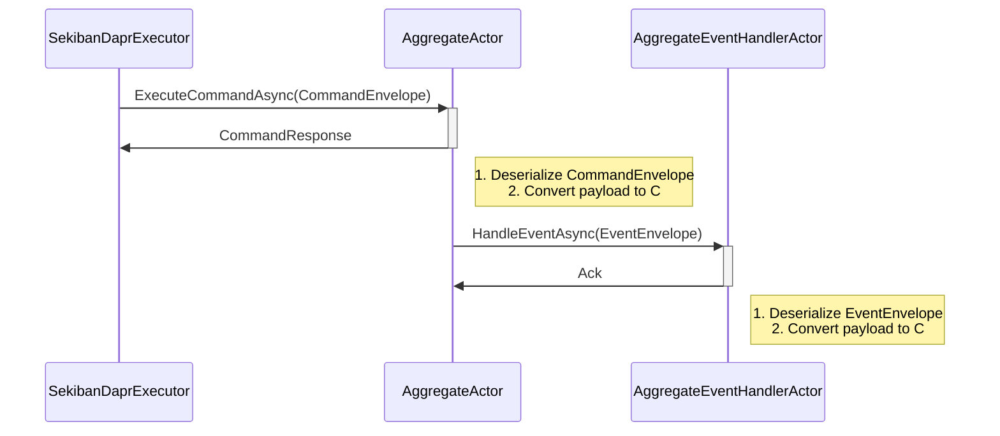

Gemini

# Dapr版イベントソーシング実装の改善設計

## 1. はじめに

本ドキュメントは、`tasks/658/improvement3.md` に記載された課題を解決するための設計案を提示するものです。

## 2. 現状の課題

現在のDapr版イベントソーシング実装では、`IAggregateActor` のメソッドがインターフェース型の引数を取るため、Daprのシリアライゼーションがうまく機能しない問題があります。

```csharp
// src/Sekiban.Pure.Dapr/Actors/IAggregateActor.cs
public interface IAggregateActor : IActor
{
    // ...
    Task<Either<ErrorRecord, JsonElement>> ExecuteCommandAsync(ICommandCommon command);
    // ...
}
```

この問題を解決するため、アクター間の通信には具体的な型（POCO）を使用し、シリアライズの問題を回避する新しいアーキテクチャを提案します。

## 3. 提案アーキテクチャ

### 3.1. メッセージフロー

新しいメッセージフローは以下のようになります。



### 3.2. データ構造

アクター間の通信には、Protobufでシリアライズされたペイロードを持つエンベロープクラスを使用します。

#### 3.2.1. CommandEnvelope

`SekibanDaprExecutor` から `AggregateActor` へ渡されるコマンドをラップします。

```csharp
// src/Sekiban.Pure.Dapr/Actors/CommandEnvelope.cs
public record CommandEnvelope(
    string CommandType, // コマンドの型名
    byte[] CommandPayload, // Protobufでシリアライズされたコマンド
    string AggregateId,
    Guid PartitionId
);

public record CommandResponse(
    bool IsSuccess,
    byte[]? EventPayload, // 発生したイベントのProtobufペイロード
    string? ErrorJson
);
```

#### 3.2.2. EventEnvelope

`AggregateActor` から `AggregateEventHandlerActor` へ渡されるイベントをラップします。

```csharp
// src/Sekiban.Pure.Dapr/Actors/EventEnvelope.cs
public record EventEnvelope(
    string EventType, // イベントの型名
    byte[] EventPayload, // Protobufでシリアライズされたイベント
    string AggregateId,
    Guid PartitionId
);
```

### 3.3. Protobufの活用

コマンドとイベントは、Protobufを用いてシリアライズ・デシリアライズします。これにより、型安全性を確保しつつ、パフォーマンスと相互運用性を向上させます。

各コマンド・イベントに対応する `.proto` ファイルを定義し、ソースジェネレータでC#クラスを生成します。

**例: `CreateAccount.proto`**

```protobuf
syntax = "proto3";

package Sekiban.Dapr.Sample.Commands;

message CreateAccount {
    string account_id = 1;
    string name = 2;
}
```

## 4. 実装計画

### 4.1. `src/Sekiban.Pure.Dapr` プロジェクトの変更

1.  **`IAggregateActor` の変更:**
    *   `ExecuteCommandAsync` のシグネチャを `Task<CommandResponse> ExecuteCommandAsync(CommandEnvelope envelope)` に変更します。

2.  **`AggregateActor` の実装変更:**
    *   `ExecuteCommandAsync` 内で以下の処理を実装します。
        1.  `CommandEnvelope` から `CommandPayload` を取り出し、ProtobufデシリアライザでC#コマンドオブジェクトに変換します。
        2.  既存のコマンド実行ロジックを呼び出します。
        3.  実行結果（成功または失敗）と、成功した場合は生成されたイベントをProtobufでシリアライズし、`CommandResponse` として返します。
        4.  生成されたイベントを `EventEnvelope` にラップし、`AggregateEventHandlerActor` を呼び出します。

3.  **`SekibanDaprExecutor` の変更:**
    *   `ExecuteCommandAsync` メソッドは、開発者がC#コマンドオブジェクトを渡せるように、既存のインターフェースを維持します。
    *   内部で、渡されたC#コマンドをProtobufでシリアライズし、`CommandEnvelope` を作成して `AggregateActor` を呼び出すように変更します。

4.  **Protobuf関連のヘルパークラスの追加:**
    *   型名とProtobufメッセージのマッピングを管理するクラス。
    *   シリアライズ・デシリアライズを行うユーティリティクラス。

### 4.2. `internalUsages/DaprSample` プロジェクトの変更

1.  **ドメインオブジェクトのProtobuf定義:**
    *   サンプルプロジェクトのコマンドとイベントに対応する `.proto` ファイルを作成します。
    *   `csproj` を編集し、Protobufのコード生成を有効にします。

2.  **DIコンテナの設定変更:**
    *   新しい `SekibanDaprExecutor` の設定や、Protobuf関連のサービスの登録を行います。

3.  **APIコントローラーの変更:**
    *   APIは引き続きC#のコマンドオブジェクトを受け取ります。`SekibanDaprExecutor` が内部で変換処理を行うため、コントローラー側の大きな変更は不要です。

### 4.3. テストケース

1.  **`Sekiban.Pure.Dapr.Tests` (新規または既存のテストプロジェクト):**
    *   `SekibanDaprExecutor` がコマンドを正しくシリアライズし、`AggregateActor` を呼び出せることの単体テスト。
    *   `AggregateActor` が `CommandEnvelope` を正しくデシリアライズし、コマンドを実行できることの単体テスト。
    *   `AggregateActor` がイベントを正しくシリアライズし、`AggregateEventHandlerActor` を呼び出せることの単体テスト。
    *   DaprのTestKitを利用した結合テスト。

## 5. まとめ

本設計により、Dapr Actorのシリアライゼーション問題を解決し、Protobufの導入による型安全性とパフォーマンスの向上を実現します。メッセージングのためのエンベロープクラスを導入することで、アクター間の通信がより堅牢になります。
