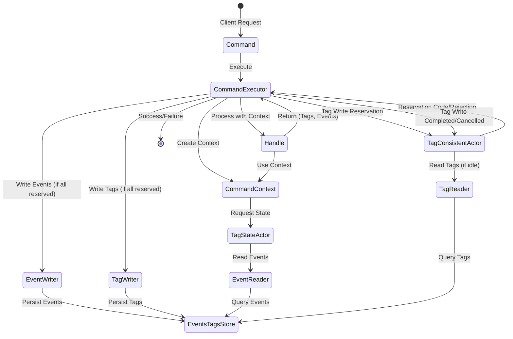
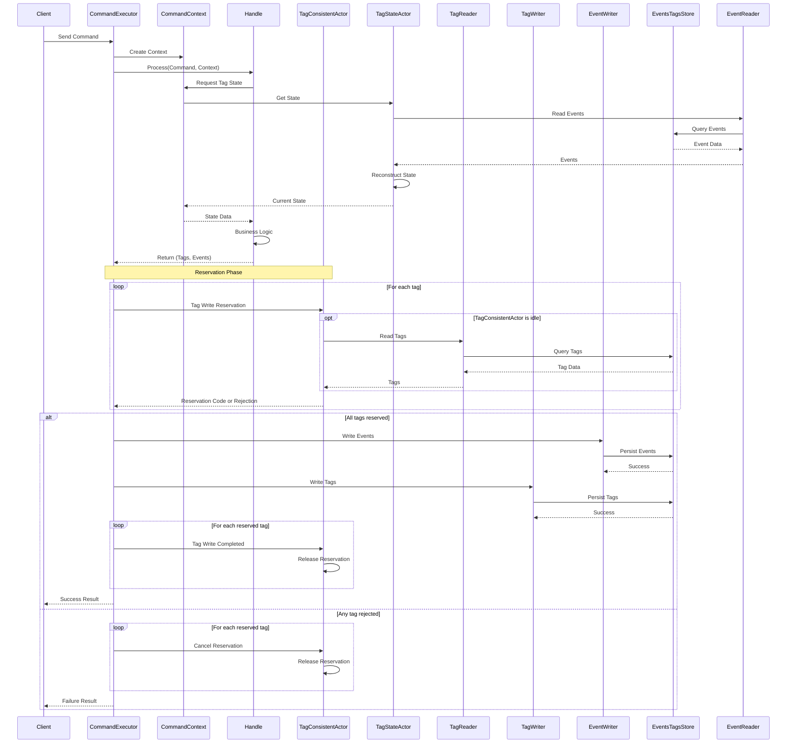

# DCB (Dynamic Consistency Boundary) Concept

## Overview

The DCB (Dynamic Consistency Boundary) is an event sourcing system that provides dynamic consistency boundaries and scalability through actor-based architecture.

## Related Documents

- [Interfaces](./interfaces.md) - Core interface definitions
- [Records](./records.md) - Record type definitions

## Core Components

### Command Flow



## Component Responsibilities

### Command

- Entry point for all operations
- Contains the intent and data for state changes
- Validated before processing

### CommandExecutor

- Orchestrates command execution
- Creates and manages CommandContext
- Passes CommandContext to Handle for processing
- Receives Tags and Events from Handle
- Requests write reservations from TagConsistentActors
- Only proceeds with writes if all tags are reserved
- Writes Tags through TagWriter and Events through EventWriter
- Sends completion or cancellation signals to TagConsistentActors
- Manages transaction boundaries and rollback on failures

### CommandContext

- Provides access to tag state during command processing
- Encapsulates state access patterns
- Can request state from TagStateActor
- Maintains consistency during command execution
- Provides transactional context for handlers

### Handle

- Command handler that processes the business logic
- Receives Command and CommandContext as parameters
- Validates command against current state
- Returns Tags and Events to CommandExecutor
- Pure function that doesn't perform side effects

### TagConsistentActor

- Ensures consistency per tag (aggregate)
- Reads initial state from TagReader when starting from idle
- Manages write reservations for tags
- Issues reservation codes when accepting write requests
- Blocks other requests while holding an active reservation
- Supports reservation cancellation and expiration
- Releases reservation upon receiving "Tag Write Completed" signal
- Prevents concurrent modifications through reservation mechanism

### TagStateActor

- Manages the current state of a specific tag
- Reads events from EventReader to reconstruct state
- Caches state in memory for performance
- Provides state to CommandContext for queries
- Does not write state directly (read-only actor)

### TagReader

- Reads tags from EventsTagsStore
- Provides tag metadata and version information
- Used by TagConsistentActor when starting from idle

### TagWriter

- Writes tags to EventsTagsStore
- Records tag versions and metadata
- Called by CommandExecutor after successful reservation

### EventReader

- Reads events from EventsTagsStore
- Used by TagStateActor to reconstruct state from events
- Supports event replay and projection building
- Enables event sourcing queries

### EventWriter

- Writes events to EventsTagsStore
- Ensures event ordering and consistency
- Called by CommandExecutor after successful reservation
- Handles event persistence failures

### EventsTagsStore

- Unified storage for both events and tags
- Provides atomic writes for consistency
- Supports queries for events and tag metadata
- Initial implementation without separate state store

## State Management Flow



## Actor Design

### Actor Identification

Actors in the DCB system use specific ID patterns for routing and isolation:

#### TagConsistentActor ID

```string
"[tagGroupName]:[tagContentName]"
```

Example: `"Account:12345"` or `"Order:ABC-789"`

#### TagStateActor ID

```string
"[tagGroupName]:[tagContentName]:[TagProjectorName]"
```

Example: `"Account:12345:BalanceProjector"` or `"Order:ABC-789:StatusProjector"`

This naming convention ensures:

- Clear separation between different tag groups
- Unique identification of consistency boundaries
- Support for multiple projections per tag

## Tag Write Reservation Mechanism

The reservation mechanism ensures strong consistency across multiple tags:

1. **Reservation Request**: CommandExecutor requests write reservations from all TagConsistentActors involved
2. **Reservation Response**: Each TagConsistentActor either:
   - Accepts: Returns a reservation code and blocks other requests
   - Rejects: Returns rejection if already reserved or unavailable
3. **Write Decision**:
   - If all tags reserved: Proceed with writes to EventStore and StateStore
   - If any tag rejected: Cancel all obtained reservations
4. **Completion Signal**: After successful writes, send "Tag Write Completed" to release reservations
5. **Expiration**: Reservations automatically expire after timeout to prevent deadlocks

## Key Design Principles

1. **Tag-based Consistency**: Each tag (aggregate) has its own consistency boundary managed by a dedicated actor
2. **Event Sourcing**: All state changes are captured as events, enabling audit trails and temporal queries
3. **Actor Model**: Leverages actors for concurrency control and state isolation
4. **CQRS Pattern**: Separates read and write operations for optimal performance
5. **Eventual Consistency**: Cross-tag operations are eventually consistent while maintaining strong consistency within each tag

## Benefits

- **Scalability**: Tags can be distributed across multiple nodes
- **Consistency**: Actor model ensures no concurrent modifications
- **Auditability**: Complete event history for every state change
- **Performance**: In-memory state caching with persistent backing
- **Resilience**: Event sourcing enables state reconstruction

## CommandContext Usage Pattern

The CommandContext provides a clean abstraction for command handlers to access aggregate state.

Key benefits:

- State access is controlled and consistent
- Handlers remain pure and testable
- Cross-aggregate operations are explicit
- Transaction boundaries are clear
