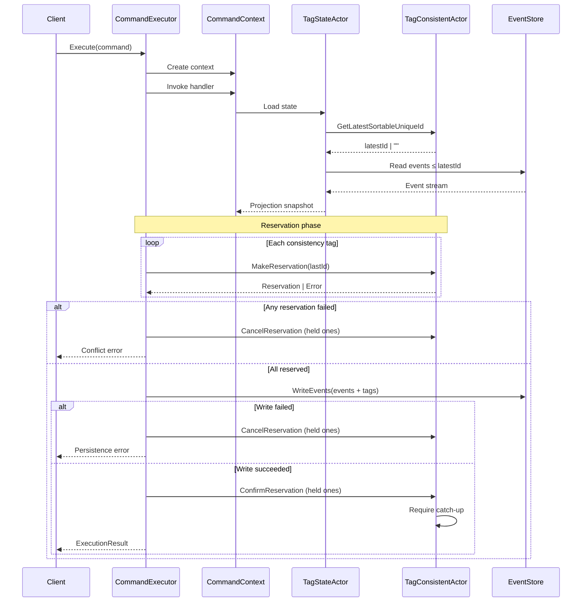
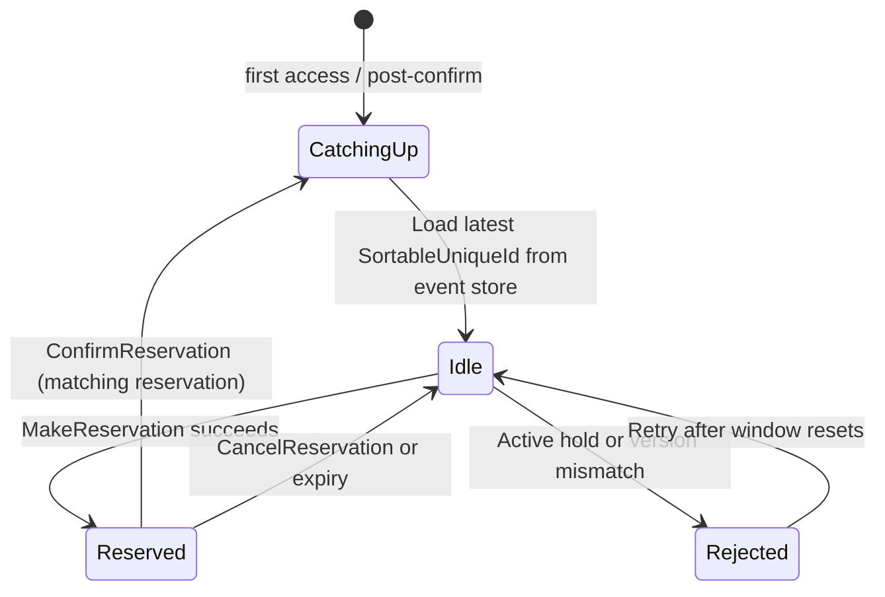

# DCB (Dynamic Consistency Boundary) Concept

## Overview

The DCB (Dynamic Consistency Boundary) runtime is an event-sourced platform that guards tag-level consistency by coordinating write reservations through actors. In concrete terms, “strong consistency” means that every command reserves all involved tags, persists all resulting events through a single `IEventStore.WriteEventsAsync` call, and only then releases those reservations. The project does **not** advertise the full ACID guarantees of a relational database; atomicity and durability depend on the event-store backend, and any work outside the reserved tags remains eventually consistent.

## Related Documents

- [Interfaces](./interfaces.md) – Core interface definitions
- [Records](./records.md) – Record type definitions

## Implemented Capabilities

- **Multi-tag reservation** – `GeneralSekibanExecutor` gathers reservations from every tag flagged as `IsConsistencyTag()` and aborts the command if any reservation fails (src/Sekiban.Dcb/Actors/GeneralSekibanExecutor.cs:112-163).
- **Best-effort two phase** – Reservations are confirmed only after `WriteEventsAsync` succeeds; failures trigger `CancelReservationAsync` on already-held reservations (src/Sekiban.Dcb/Actors/GeneralSekibanExecutor.cs:189-233).
- **Reservation expiry** – `TagConsistentActorOptions.CancellationWindowSeconds` bounds reservation lifetime and `CleanupExpiredReservations` clears stale entries (src/Sekiban.Dcb/Actors/GeneralTagConsistentActor.cs:236-250).
- **Version-aware isolation** – `GeneralTagConsistentActor.MakeReservationAsync` rejects stale `SortableUniqueId` expectations, enabling optimistic concurrency; automated tests verify that conflicting updates fail (src/Sekiban.Dcb/Actors/GeneralTagConsistentActor.cs:83-110, tests/Sekiban.Dcb.Tests/OptimisticLockingTest.cs:200-214).
- **Read-your-write safety** – `ConfirmReservationAsync` forces the next TagConsistentActor call to re-catch-up from the event store, while `GeneralTagStateActor` only projects events up to that actor-reported id (src/Sekiban.Dcb/Actors/GeneralTagConsistentActor.cs:126-134, src/Sekiban.Dcb/Actors/GeneralTagStateActor.cs:109-140).
- **Unified event/tag persistence** – All `IEventStore` implementations persist event payloads and tag rows together; Postgres uses an RDBMS transaction while Cosmos DB issues best-effort multi-item writes (src/Sekiban.Dcb.Postgres/PostgresEventStore.cs:130-177, src/Sekiban.Dcb.CosmosDb/CosmosDbEventStore.cs:175-231).
- **Cached projections** – `GeneralTagStateActor` stores materialized state in-memory and refreshes it only when the SortableUniqueId advances or the projector version changes (src/Sekiban.Dcb/Actors/GeneralTagStateActor.cs:109-308).

## Command Flow

## TagConsistentActor Lifecycle

## Component Responsibilities

### CommandExecutor

- Validates commands and instantiates `GeneralCommandContext`.
- Collects events emitted by the handler as well as those appended through the context.
- Requests reservations for every consistency tag using the last known SortableUniqueId when none is supplied explicitly.
- Calls `IEventStore.WriteEventsAsync` once all reservations succeed and cancels otherwise.
- Confirms reservations on success (best effort) and cancels them if the write fails.
- Optionally publishes events asynchronously through an `IEventPublisher` implementation.

### CommandContext

- Fetches tag projections via TagStateActors and records the exact `TagState` instances used during command validation.
- Offers helpers for optimistic concurrency by exposing the `LastSortedUniqueId` for accessed tags.
- Provides convenience methods to append additional events and to query tag existence or latest ids without duplicating work.

### Command Handlers

- Contain business logic that inspects projections via the context and returns domain events with tags.
- Remain side-effect free; the executor handles persistence and reservation lifecycles.

### TagConsistentActor

- Lazily catches up from the event store to discover the latest committed SortableUniqueId.
- Maintains at most one in-flight reservation and validates optimistic version checks.
- Stores reservation metadata in-memory with expirations driven by `TagConsistentActorOptions`.
- On confirmation, clears the reservation and forces the next request to re-catch-up.
- On cancellation or expiry, simply removes the reservation; there is no persisted decision log.

### TagStateActor

- Requests the latest SortableUniqueId from the TagConsistentActor that owns the tag.
- Replays events from the event store up to that id, either incrementally from cache or via full rebuild when the projector version changes.
- Persists projections in-memory via `ITagStatePersistent` to avoid redundant replays.
- Never mutates state directly; it only materializes read models.

### Event Store

- Serves as the single persistence boundary for event payloads and tag associations.
- Offers read APIs for global streams and tag-filtered subsequences.
- Implements `WriteEventsAsync` to persist both events and tag records in one call; transactional strength depends on the concrete backend.

### Actor Identification

- `TagConsistentActor` id: `"[tagGroupName]:[tagContentName]"`
- `TagStateActor` id: `"[tagGroupName]:[tagContentName]:[ProjectorName]"`

These conventions support deterministic routing, isolation between tags, and multiple projections per tag.

## Tag Write Reservation Mechanism

1. **Request** – `GeneralSekibanExecutor` asks each TagConsistentActor for a reservation, optionally passing the last observed SortableUniqueId.
2. **Validation** – The actor refuses the reservation when another hold is active or when the optimistic version mismatches the current id.
3. **Persistence** – The executor persists all events and tag rows through a single `WriteEventsAsync` call once every reservation is granted.
4. **Confirm or Cancel** – Success triggers best-effort confirmation so the actor can release the hold and mark itself for catch-up; failures result in best-effort cancellation. No decision log or retry worker exists today, and operational recovery relies on clients retrying commands after faults.
5. **Expiry** – Reservations expire after `CancellationWindowSeconds` and are purged on the next actor access.

## Key Design Principles

1. **Tag-based Consistency** – Each tag represents a dynamic consistency boundary managed by a dedicated actor.
2. **Event Sourcing** – All state mutations are captured as events, enabling audits and temporal queries.
3. **Actor Isolation** – Actors provide natural concurrency control and cache locality for hot tags.
4. **CQRS Alignment** – Reads and writes are separated; command handlers never persist directly.
5. **Scoped Strong Consistency** – Operations within the reserved tag set are coordinated; outside that scope the system remains eventually consistent.
6. **Observability** – Reservation, confirmation, and cancellation flows carry correlation data so they can be traced, with future metrics expected to surface contention and failure patterns.

## Benefits

- **Scalability** – Tag-level actors can be distributed across nodes to balance load.
- **Deterministic Concurrency** – Reservations and optimistic version checks prevent conflicting updates.
- **Auditability** – Every business fact is captured as an immutable event.
- **Performance** – Cached projections avoid reprocessing entire streams on each read.
- **Resilience** – Actors can re-catch-up from the event store after restarts or reservation confirmations.

## Trade-offs

- **Fault recovery** – Reservation confirmations and cancellations are best effort with no persisted decision log; if the coordinator fails mid-flight, downstream convergence depends on clients retrying the command.
- **Observability gaps** – Although `EventMetadata.CorrelationId` exists, there is no formal metrics pipeline yet to expose reservation success rates, latency, or conflict hotspots.
- **Hot-tag contention** – Frequently accessed tags can suffer higher reservation failure rates, requiring careful boundary design or tag partitioning strategies.
- **Backend dependence** – Postgres benefits from transactional guarantees, whereas Cosmos DB operates on a best-effort basis, shifting the effective consistency to the storage provider.

## CommandContext Usage Pattern

1. Create a command handler that receives `ICommandContext`.
2. Fetch the necessary tag states via `context.GetStateAsync<TProjector>(tag)`.
3. Perform business validation using the returned projections.
4. Return an `EventPayloadWithTags` (or append multiple events) that lists every tag involved.
5. Rely on `GeneralSekibanExecutor` to handle reservations, persistence, and publication.
