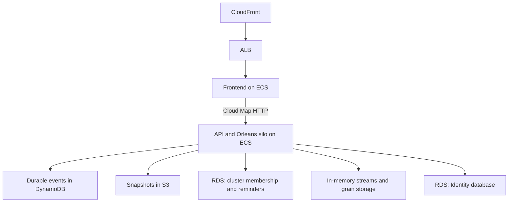

# SekibanDcbDeciderAws Infrastructure

AWS CDK Infrastructure for deploying SekibanDcbDeciderAws with DynamoDB.

## Architecture



The shipped CDK stack sets `Orleans__UseInMemoryStreams=true`: both Orleans stream providers, PubSubStore and grain storage are in memory. Restarting a silo loses queued stream delivery, subscriptions and grain state; durable DCB events remain in DynamoDB and projections can rebuild from them. This configuration does not provide durable stream delivery across restarts or multi-silo stream routing. SQS is provisioned as a reserved resource but is not used. RDS backs cluster membership and reminders, not grain state. Configure and verify durable streaming and grain persistence before relying on those guarantees in production.

The local AppHost also supplies a PostgreSQL database for the MV sample. The deployed stack does not supply `ConnectionStrings__DcbMaterializedViewPostgres`; provide a separate MV target connection and schema permissions to enable that sample in a cloud deployment.

## Components

| Service | Purpose |
|---------|---------|
| CloudFront | HTTPS frontend with caching disabled |
| ALB | HTTP load balancer for WebNext service |
| RDS PostgreSQL (Orleans) | Orleans cluster membership and reminders; grain state is in memory |
| RDS PostgreSQL (Identity) | ASP.NET Identity (Authentication) |
| DynamoDB | DCB Event Store (auto-created by app) |
| SQS | Provisioned but unused by the application; streams are in memory |
| S3 | Snapshot Offload |
| ECS Fargate (API) | Orleans Silos + REST API (internal only) |
| ECS Fargate (WebNext) | Next.js Frontend (external) |
| Cloud Map | Internal Service Discovery (WebNext → API) |

## Quick Start

### 1. Install dependencies

```bash
npm install
```

### 2. Configure

```bash
cp config/dev.sample.json config/dev.json
# Edit config/dev.json with your settings
```

### 3. Build and Push Container Images

```bash
./scripts/build-push.sh dev all
```

### 4. Deploy

```bash
./scripts/deploy.sh dev
```

## Scripts

| Script | Purpose |
|--------|---------|
| `scripts/deploy.sh dev` | Deploy to dev environment |
| `scripts/deploy.sh prod` | Deploy to production environment |
| `scripts/build-push.sh dev all` | Build and push all container images |
| `scripts/build-push.sh dev api` | Build and push API service only |
| `scripts/build-push.sh dev webnext` | Build and push WebNext service only |

## Local Development

Run locally with Aspire and LocalStack:

```bash
cd ../SekibanDcbDeciderAws.AppHost
dotnet run
```

## Cost Estimate (Dev Environment)

| Component | Monthly Cost (Est.) |
|-----------|---------------------|
| ECS Fargate API | ~$28-40 |
| ECS Fargate WebNext | ~$8-12 |
| RDS PostgreSQL (Orleans) | ~$12 |
| RDS PostgreSQL (Identity) | ~$12 |
| ALB | ~$18-24 |
| CloudFront | ~$1-5 |
| DynamoDB/S3/SQS | ~$0-10 |
| **Total** | **~$79-115** |

Before deploying the API, supply `Jwt__SecretKey` (at least 32 characters) from a secret store. For Azure, add an App Service Key Vault reference or a Container Apps secret reference to that environment variable; for ECS, add a Secrets Manager reference in the task definition's `secrets`. The shipped infrastructure does not provision this secret. Startup fails without it. Sample users are created only in Development; to bootstrap the first administrator outside Development, also supply `Auth__InitialAdmin__Email` and `Auth__InitialAdmin__Password` from secrets. An existing account is never promoted by this setting. Identity tables and roles are initialized in every environment.
